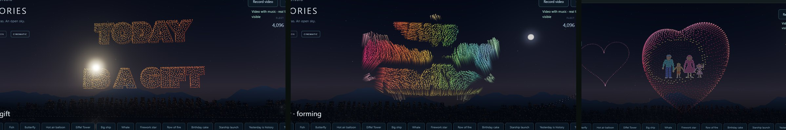
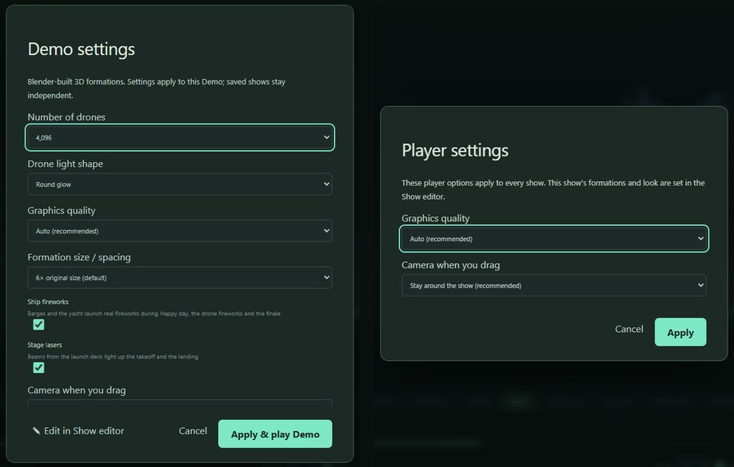

# Draw in 3D

**[Open the web app](https://s0lluxx26.github.io/Draw_in_3D/)** · [GitHub repository](https://github.com/S0lluxx26/Draw_in_3D) · [Publishing and phone access](docs/GITHUB_PAGES.md)

Android AR drawing and small game-map editor prototype, with a **PC browser editor** sharing the same editable project files. Built for a **Galaxy S9+ baseline**, with a later Galaxy S22 Ultra review.

## Studio 22: a whale that swims and blows, a spinning 3D star, readable words


The **whale swims** through a rolling sea: it rises and dives with each stroke, glows deep blue under water, and **blows its split spout whenever its blowhole breaks the surface**. The **five-point star is a faceted 3D star** that makes one smooth full turn as it grows and spins. The sentence before HAPPY DAY now uses **thinner, brighter letters** that read clearly, and each phrase gets **three fireworks**. Show editor fixes: converting Happy day keeps its own 16 s display, and a Happy day too short for its sentence plays HAPPY DAY alone. [Details and checks](docs/STUDIO22.md).

## Studio 21: a sentence for Happy day, a 3D heart, showpiece fireworks



Before **HAPPY DAY**, the drones now spell out *"Yesterday is history, tomorrow is a mystery, today is a gift — that's why it's called the present"* in 3D letters, one phrase at a time, gliding from each phrase into the next with their colours blending. The **growing heart is a 3D heart**: shaded, with a locket window where the family stands. It turns as it grows and **beats** before falling into sparks. New **showpiece fireworks** burst around the heart and through the sentence: colour-changing chrysanthemums, glittering gold crowns, crossed double rings and heart shells. The Demo runs 6:59. [Details and checks](docs/STUDIO21.md).

## Studio 20: candles that burn, a family you can recognise


The Demo's **birthday cake** now has a bright flame on every candle, and the flames dance and flicker through the display. The **growing heart's family** is drawn as people instead of sticks: a man, a boy, a woman in a dress and a waving girl, with faces, hair, arms and clothes, holding hands. [Details and checks](docs/STUDIO20.md).

## Studio 19: design drone formations in 2D


The Show editor's stage is now a **2D formation designer**. Draw straight onto the sky stage with the pen, lines, boxes, ellipses, hearts, stars and text. **Fill** shapes with rings of drones, **Mirror** both halves, and trace over a picture. Then select shapes to move, resize, rotate, recolour, duplicate or flip them. The dots are the drones and follow live as you draw. **▶ Run from here** shows them flying into it. Demo formations convert onto the stage, and saved shows stay editable. [Details and checks](docs/STUDIO19.md).

## Studio 18: late afternoon, drones you can watch fly, a firework finale


**Settings → Background** switches between **Dark night** and a golden **Late afternoon**, live, for any show. Between shapes every drone now **blinks red or blue at a quarter of full light**, so you can watch the fleet fly to the next shape. Each formation holds **3 s longer** (15 s) and shape changes take **7 s** instead of 9. The landing is longer and becomes a **firework finale**: rolling salvos, **heart, star and Saturn shaped shells**, and a wall of every kind of shell at once over the harbour, while the drones touch down. The Show editor is built around Run: **▶ Run from here**, **Back** returns to the formation you were watching, the preview is exactly what Run plays, and ⚠ cards flag problems before Run. The Demo runs 6:27. [Details and checks](docs/STUDIO18.md).

## Studio 17: the Demo and the Show editor in step



The Demo and your edited Demo now behave the same way. Change **Demo settings** and the Show editor's Demo follows, as long as you haven't edited it. Played unedited, it matches the Demo: same title, fleet, length and cues. **Demo settings → ✎ Edit in Show editor** opens the Demo you are watching in the editor, on the formation that was playing. Your own shows get **Player settings** for graphics quality and camera. **Convert to drawing** keeps the Fish's waves and the Whale's spout. New drawings in a Demo-style show get the Demo's 12 s display. Recordings are named after the show. On PCs, **← Back to drawing** from the Demo works again; it was stuck in Cinematic graphics. [Details and checks](docs/STUDIO17.md).

## Studio 16: edit the Demo, swimming fish, three balloons, a family in the heart


**Show editor → Edit demo** now opens the Demo itself: its Blender 3D formations, their motion, its look and its finale. Remove, reorder or retime formations, switch falling fire, add your own drawings or more Demo formations, then **Save show**. **Open show** later to keep editing, and **Play my show** performs it just like the Demo. **Convert to drawing** turns a Demo formation into editable line art. The **fish swims** under three rolling waves. **Three hot air balloons** (one big, two small) drift up with flickering burner flames. The **growing heart** holds a family: a man, a boy, a woman and a waving girl holding hands. **Record video** saves a WebM (or MP4) with music, and now writes its length, so players can show it and seek. [Details and checks](docs/STUDIO16.md).

## Studio 15: phone-friendly show, whale, flapping butterfly and lasers


On phones the **show now gets the screen**. The title, status, Record and Back share one slim top bar. Playback sits in one compact panel with icon buttons and a swipeable cue strip, and **landscape works**. Dragging keeps the camera **around the show**: it follows each formation within angle and zoom limits, so a stray swipe can't lose it. **Demo settings** can switch to free orbit. Each formation now **holds for about 12 s**. The **butterfly flaps its wings**. A Blender-modelled **whale** swims with a travelling wave and **blows a split water spout** from its blowhole. **Stage lasers** light up the takeoff and the landing. The Demo runs 6:05 with 12 formations. [Details and checks](docs/STUDIO15.md).

## Studio 14: realistic drones, HAPPY DAY and ship fireworks


Drones are now **detailed Blender quadcopters** with prop guards, spinning props, battery, landing gear and an LED pod. They lean into their flight, and the Demo opens and ends on a close-up of the launch pads. **Four new formations** were added (Butterfly, Hot air balloon, Birthday cake and **HAPPY DAY** in 3D letters), bringing the Demo to 5:03. **Ships on the river** (firework barges, a party yacht, a tug and sailboats) bob on the swell and **launch real fireworks** during HAPPY DAY, the drone fireworks and the finale. The fireworks come in six patterns, computed on the GPU so seeking and recording stay exact. The Demo now has an **exciting soundtrack generated live in the browser**: build-ups and snare rolls while each formation forms, a drop with crash when it appears, a key change for the drone fireworks, booms synced to every ship-firework burst and a calm landing. It follows pause, seek, speed and cues, is included in recorded videos, and **♪ Music** mutes it. The show now **waits at 00:00 until the harbour scenery has loaded**, so a first visit to the website opens on the launch pads instead of part-way in. New visitors see **▶ Watch the drone show** on the welcome card: one click starts the Demo with music from the first beat. **[…/Draw_in_3D/#demo](https://s0lluxx26.github.io/Draw_in_3D/#demo)** opens straight into it for sharing. [Details, Blender pipeline and checks](docs/STUDIO14.md).

## Studio 13: cinematic sky stage


Drone shows now perform over a **night harbour built in Blender**: a lit launch deck, skyline, bridge, mountains, a moonlit sky and reflective water. HDR **bloom**, a **director camera** that frames every formation and a **Graphics quality** choice (Auto, Cinematic, Balanced, Battery saver) come with adaptive resolution for phones. All seven Demo formations were **remodelled in Blender** with colour gradients and cleaner LED sampling; the asset shrank from 1.27 MB to 389 KB. A three-part logic audit fixed editor, drone-show and Android bugs, including the Android gyro view, lost crash recovery, the eraser cutting hidden strokes and texture re-uploads while dragging images. [What changed, the Blender pipeline, every fix and how it was verified](docs/STUDIO13.md).

## Studio 12: Blender formations and Demo settings

**Demo settings** selects 256–4,096 drones, round/diamond/star lights, 4×–8× formation scale (twice the previous size) and fire for each formation. Demo now uses detailed 3D Blender meshes, including a striped fish with fins and gills, a multi-deck ship and a rising Starship. Transitions and their trails blink only dim red/blue and last nine seconds. The 3:49 Demo ends with growing heart/star/three-ball fireworks, blinking falling sparks and a slower 14-second reverse-takeoff landing with an elevated camera. [Controls, Blender editing and review](docs/STUDIO12.md).

## Studio 11: 4,096-drone sky performance

Demo now uses **4,096 drones (16×)** with larger light dots and alternating red/blue navigation flashes during takeoff and landing. It adds a big ship, sparkling firework star, a row of falling fire and a slowly rising Starship with bright yellow exhaust. The complete demo lasts 155 seconds.

**Show editor → Edit demo** exposes all seven drawings and their motion effects. Choose Fleet size for 4,096 or the legacy 256-drone option. Show v2 preserves effects and fleet size; old v1 shows still load. [Controls, performance changes and review](docs/STUDIO11.md).

## Studio 10: create the demo yourself

**Show editor → Edit demo** opens the robot, fish and Eiffel Tower as editable drawings. Edit their ink with the existing drawing tools, add your own formations, reorder cards, adjust timing, placement and light reveals, and play the resulting show. Your original drawing and its undo history are preserved. Save/Open show uses a separate editable `.show.json` file, with browser-local show recovery.

**Record video** in the player creates a silent 720p real-time recording, with supported WebM/MP4 detection. Keep the tab visible through landing. Native Android remains 0.8; use the web app on Android for show editing. [Step-by-step help](docs/SHOW_EDITOR_GUIDE.md) · [Implementation plan and logic/code review](docs/SHOW_AUTHORING_PLAN.md).

## Studio 09: drone-show simulator

Click **✦ Demo** above the canvas to play an 87-second show: takeoff → robot → fish → Eiffel Tower → light fireworks → landing. It uses 256 persistent virtual drones, timed light reveals and continuous trajectories. Pause/replay, seek a formation, change speed, orbit and toggle trails. **Replay my drawing** in the inspector turns your stroke lines and colours into a sky formation, including curved-sheet depth. Back to drawing restores your editor session.

This is a browser visual simulator. Flight constraints and real drone control are future work; Android's native app remains 0.8. [Implementation, researched workflow, production roadmap and review](docs/DRONE_SHOW_PLAN.md).

## Studio 08: recovery, named sheets and drag depth

**Drafts** saves committed edits in this browser and offers Restore, Download and Delete. **Sheet name** organizes your guides. **Drawing helpers → Drag depth from this view** previews moving a sheet with its ink; release applies one undo step, Esc cancels. Existing stepped depth and parallel-sheet tools remain available.

Named sheets use **v6**, requiring **Android 0.8+**. The local APK is artifacts/Draw-in-3D-v0.8.0-debug.apk. Unnamed files keep their previous format. Drafts do not sync devices or replace a JSON backup. Export before updating from an older editor. [Implementation plan, completed work, code/logic review and focused checks](docs/IMPLEMENTATION_PLAN_08.md). Try samples/named-guides-v6.json.

## Studio 07: research applied to drawing helpers

**See-through guides** reveal other ink while drawing. **Mirror new strokes** draws a live partner across the sheet centre; both sides undo together. **Snap stroke ends** joins Draw/Line/Curve endpoints on the active sheet. **Nearer/Farther** move a sheet with its ink in small depth steps, and **Add parallel sheet** creates a blank layer without copying the drawing. These controls are in **Paper & surface → Drawing helpers** on web; the resulting files work in the existing **Android 0.6** app.

This increment applies ideas from Feather, Gravity Sketch and Open Brush. [Primary-source research, controls, design review and checks](docs/DRAWING_ASSISTS.md). Try samples/drawing-assists.json. Export unsaved work before refreshing to Studio 07.

## Studio 06: hide the paper, keep the 3D ink

Draw on a sheet, then **Hide sheet · keep ink** to remove its background. The invisible guide stays editable: bend or position it with its paint, draw inside its dotted outline, or Show sheet again. **View 3D ink** hides all sheets and the grid and switches to Orbit. Orbit to a new angle, add another sheet, and keep drawing with your existing pen settings and previous ink as a reference. Visibility is undoable and saved. **Delete sheet + ink** still removes both.

Hidden-guide exports use **v5**, requiring **Android 0.6+**. The new native prototype is artifacts/Draw-in-3D-v0.6.0-debug.apk; its Paper / surface menu adds hide/show controls. Try samples/ink-guides-v5.json. [Workflow, internet research, design review and verification](docs/FLOATING_INK.md). **Export unsaved browser work before refreshing** to load Studio 06.

## Studio 05.1: draw after orbiting and preview panoramas

**Add a paper sheet** now faces your current view and activates Draw. **Focus sheet** prevents other sheets from covering your paint; **Show all objects** restores the full scene. Use **Curved monitor** or **Panorama** directly in Paper & surface to wrap an existing drawing. **Panorama view** lets you drag to look around from a fixed viewpoint, then return to drawing. Undo/redo also restores the active paint target. Export your work before refreshing the browser. [Reproduction, fixes and checked workflow](docs/PAPER_WORKFLOW_FIX.md).

## Studio 05: bendable drawing surfaces

Draw on a flat sheet, then use **Edit active surface → Surface bend** to curve it with its paint. XYZ, Yaw, Tilt, Roll and Scale position each sheet independently. **Face sheet** adjusts the view; **Paint** resumes drawing. Add several sheets and switch using **Paint on**. Flattening, transforming, duplicating and deleting a sheet are undoable.

New strokes store sheet-local coordinates, so surface edits do not rewrite their points. Curved drawing uses actual cylinder intersections; sparse lines receive display-only segments. Export/import uses format **v4**, requiring **Android 0.5+**. Older files remain readable. Native **Adjust** adds bend, tilt and roll controls. [Workflow, storage design and logic review](docs/CURVED_SURFACES.md).

Install artifacts/Draw-in-3D-v0.5.0-debug.apk for the earlier native 0.5 prototype; use 0.6 above for current files. Try samples/surfaces-v4.json in either editor. **Export unsaved browser work before refreshing** to load Studio 05. Phone rendering, sustained performance and battery measurements remain pending.

## Studio 04: curves and stroke finishing

**Curve (Q)** draws arcs and S-curves with adjustable bend. **Smooth on release** optionally softens new freehand strokes after lifting; strength is adjustable, and **Smooth selected strokes** applies it later as an undoable edit. Open endpoints and paper attachments are preserved. Native Android has Curve in its first toolbar row and finishing/bend controls in Pen / settings.

Install `artifacts/Draw-in-3D-v0.4.0-debug.apk` for the new Android controls. Saved curves use the existing v1/v2/v3 stroke format. Read [the controls and reviewed implementation](docs/CURVES_AND_SMOOTHING.md). Export unsaved browser work before refreshing to load Studio 04.

## Studio 03: paper and paint surfaces

Add watercolor, rough watercolor, sketch, canvas or water-resistant coated sheets. Paint stays attached when a sheet moves, rotates, scales, duplicates or is deleted; undo restores the edit. Water/Wet paint uses surface grain and spread, with short runoff on coated paper. These are lightweight visual effects. Read [the paper workflow, research and logic review](docs/PAPER_SURFACES.md).

Use **Paper & surface → Add a paper sheet** on web, or **Paper / surface** in the Android toolbar. Install `artifacts/Draw-in-3D-v0.3.0-debug.apk` for paper files. Both editors import/export v1, v2 and v3. `samples/paper-v3.json` is a portable watercolor example. Export existing browser work before refreshing to load this update.

## Studio 02 tools

The browser now includes line/rectangle/ellipse tools, solid 3D blocks, dashed/dotted styles, stabilization/taper, segment/object erasers, box selection, group move/rotate/scale, duplicate, snapping, and 30-step undo/redo. Read [the tool guide and logic review](docs/EDITOR_TOOLS.md).

Android 0.2 introduced `artifacts/Draw-in-3D-v0.2.0-debug.apk` for solid blocks and patterned strokes; use the latest APK for all current features. Older projects remain supported; ordinary scenes still export v1. Advanced selection/shape/segment-erase controls are currently in the web editor. Native 0.2 adds block placement, whole-object erase and pattern presets, and can import/adjust/export the web results.

## PC browser → phone / tablet

The browser prototype is in [`web/`](web/README.md). Run `.\web\start-web.ps1` (Node.js 22+), then open **http://127.0.0.1:5173** in Chrome or Edge. The prepared `artifacts/Draw-in-3D-Web-Prototype.zip` includes the built editor and local server. No camera or account is needed.

Draw in the browser, choose **Export for phone**, transfer the `.json` file, and use **Files / more → Import project JSON** in the Android app. Strokes, pressure, brush settings, curved images and marker order stay editable. Android exports reopen with **Open project** on PC. The transfer is manual; images are embedded in the one file. Use Studio on the phone to keep the camera off, or place a new origin for optional Camera AR.

See [the shared-format design and reviewed web plan](docs/WEB_INTEROP.md). Browser authoring is implemented; browser gyro/AR and an iOS native app are not. Physical phone/tablet round-trip review is still pending.

## Android camera and power modes

**Camera-free by default (v0.1.1):** Studio uses touch without the camera or orientation sensors. Look / gyro turns the view using phone orientation, with the camera off. Camera AR is optional for real-room placement and walking around objects. Switching back to Studio/Look stops the camera; returning to AR requires origin placement again.

Stationary camera-free scenes stop redrawing after input and effects settle. The app honors the normal screen timeout, requests gyro samples at about 30 Hz, and caps the experimental 60 fps renderer to 30 under Android Battery Saver or thermal pressure. Camera-free viewing does not track phone translation. Battery savings still need measurement on the S9+.

Read [the researched and reviewed product plan](docs/PLAN.md) for the engine comparison, related apps, architecture, brush roadmap, performance targets and corrections from the logic review. The production recommendation is Unity + AR Foundation; this first executable feasibility prototype is **native Java + ARCore + OpenGL ES**, not a Unity project.

## Install the prototype

The debug APK is generated at `app/build/outputs/apk/debug/app-debug.apk`. Copy it to your phone and open it, or use Android platform tools with USB debugging enabled:

```powershell
adb devices
adb install -r app/build/outputs/apk/debug/app-debug.apk
```

Package ID: `com.drawin3d.prototype`. Android 8.0+; arm64 phones and x86_64 emulator included. AR needs an ARCore-supported device, a compatible Google Play Services for AR installation, and camera permission. Studio and Look do not require camera permission. No developer API key, account, cloud project or Blender install is needed.

This is a development-signed APK for direct review, not a Play Store release. Phone tracking, thermal stability and S9+ frame rate have not yet been measured.

## First session

1. Start in **Studio**. Drag across the view to draw. Choose **Look** in the bottom toolbar to rotate the virtual view by dragging; switch back to **Draw** to paint.
2. Optionally tap **Camera AR**, grant camera permission, and scan a textured floor/wall slowly. Tap **Origin**, then tap a detected surface. Point the camera in the desired map-forward direction during placement. Skip this step to keep the camera off.
3. Choose **Air** for drawing at a fixed distance from the screen ray, or **Surface** to capture a detected plane at stroke start. In Studio, Surface uses the floor grid.
4. Drag on the canvas, or hold **HOLD DRAW** while moving the phone. Open **Pen / settings** for Pen, Marker, Neon, Spray, Water, colours, width, opacity, distance and optional wet drips.
5. Tap **+ Image**, select a picture, then use **Select → Adjust** to move, rotate or scale it. The image appears ahead of the camera. In settings, change its curve and tap **Apply curve to selected image**. Curve ranges from flat to 300°.
6. **Look / gyro** uses the phone's orientation to look around from a fixed point. It does not know where the phone moves. **Origin** recentres it.
7. Place **Start**, optional **Checkpoint** markers, and **Goal**. Tap **Play / edit**, then tap Start, checkpoints in creation order, and Goal. Tap **Play / edit** again to return to the editor.
8. **Save** writes one private local project. **Files / more** loads it or imports/exports portable JSON with embedded images. Loading into AR requires setting the origin again. Backgrounding the app writes a separate recovery project; a force kill before that point may lose unsaved edits.

Toolbar rows scroll horizontally on narrow screens. Tap close to the centre of an image/marker or a visible stroke to select it. Movement adjustments use map axes in 10 cm steps. Undo/redo keeps the last 20 authoring operations. Delete erases an entire selected object. The native Erase tool taps away whole objects; + Block places a 0.5 m cube. Pen/settings includes solid/dash/dot styles.

## Build

Requirements: JDK 17 or 21, Android SDK platform 36 and Android build tools. Gradle wrapper and dependencies are pinned. First build needs internet to download dependencies.

```powershell
.\scripts\build.ps1
```

Or write `local.properties` with your SDK path, then:

```powershell
.\gradlew.bat --no-daemon :app:assembleDebug
```

The initial review uses a small check set:

```powershell
.\gradlew.bat --no-daemon :app:testDebugUnitTest :app:lintDebug
```

No elaborate test harness or benchmark farm is required for this stage. See [verification and known limitations](docs/VERIFICATION.md) for what is actually checked versus waiting for a phone.

## Project layout

- `docs/PLAN.md`: research, engine decision, architecture, budgets, staged delivery and review fixes.
- `web/`: Three.js browser authoring, local server and compatible JSON import/export.
- `docs/WEB_INTEROP.md`: browser ↔ Android contract, review fixes and transfer limits.
- `app/src/main/java/com/drawin3d/MainActivity.java`: native UI, AR lifecycle, sensors, file picker and render pacing.
- `SceneRenderer.java`: tracking gate, origin placement, scene editing, GPU resources and marker gameplay.
- `SceneData.java`: bounded versioned scene document and validation.
- `Geometry.java` / `Math3.java`: brush meshes, curved panels and gravity geometry.
- `ProjectIO.java`: image orientation/size handling and atomic local storage.
- `FrameDemand.java`: bounds input/effect redraw windows so unchanged camera-free scenes can idle.
- `app/src/test`: six geometry/data-integrity tests, two small render-demand checks and three real browser-file interop checks (v1/v2/v3), plus paper geometry/coordinate checks.

The prototype has no networked multiplayer, cloud anchors, depth occlusion, room-mesh reconstruction, physical fluid solver, spherical 360° photo viewer, advanced brush mixing, layers or GLB model import. Those are planned explicitly; they are not hidden behind nonworking controls.

## Dependency notices

ARCore is Google's SDK and is used under its applicable terms. AndroidX ExifInterface and the Gradle tooling retain their own licenses; JUnit and JSON-java are test dependencies only. Product examples in the research are references, not copied assets. The prototype's geometry and app icon are created in code, and user pictures are stored locally/re-encoded into their chosen project export. Review all final distribution terms before a public release.
