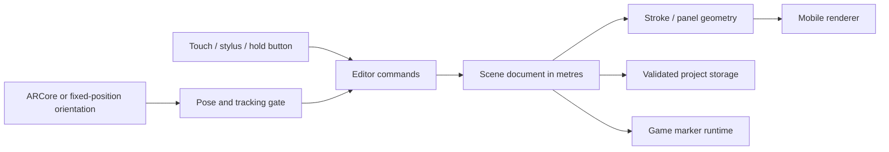

# Draw in 3D — reviewed product and engineering plan

Research date: 16 September 2026. Primary target: Samsung Galaxy S9+; second target: Galaxy S22 Ultra. This is a prototype-first plan with a premium production quality bar, not a claim that the first build has AAA quality or measured device performance.

## 1. Product decision

Build a phone-based 3D drawing and small game-map editor that works **with the camera off by default**. A creator draws in a virtual scene, places pictures on flat or curved panels, adds game markers, saves the scene, and tries a simple game within it. Gyro viewing lets the user turn the phone to look around without running the camera. Camera AR is an optional extension: scan a room, establish a map origin and place art on real surfaces. Camera-free authoring/viewing works offline without AR services; AR requires those services to be installed first.

**Google's platform is ARCore; Apple's is ARKit.** ARCore combines visual and inertial observations for phone pose estimation. A gyroscope is useful for orientation; integrating accelerometer readings is not a reliable substitute for room-scale position tracking. We therefore expose three distinct modes: touch-controlled Studio, camera-free Look mode with fixed position, and camera-based AR. [Google fundamentals](https://developers.google.com/ar/develop/fundamentals), [Android position sensors](https://developer.android.com/develop/sensors-and-location/sensors/sensors_position).

Treat “map” initially as an authored room-scale scene. It is not a GPS map, a complete reconstructed room mesh, or a portable SLAM database. The prototype's room has one origin and a four-metre content radius. Larger environments need spatial chunks and an anchor policy before expanding scope.

## 2. Similar products and what to learn

| Reference | Relevant behavior | Decision for this app |
| --- | --- | --- |
| [Google Just a Line](https://experiments.withgoogle.com/justaline) | Drawing in air with a phone; the official page now labels the experiment inactive | Adopt a simple hold-to-draw interaction; use as historical interaction research, not a supported product dependency |
| [World Brush, by its creators](https://medium.com/active-theory/world-brush-augmented-reality-painting-7910766b2bba) | Paintings tied to places and discovered by other people | Useful spatial-art precedent; current availability not verified; public discovery comes after private creation works |
| [Open Brush](https://openbrush.app/) and [brush documentation](https://docs.openbrush.app/user-guide/brushes/experimental-brushes) | Volumetric strokes, varied materials and animated brushes in XR | Borrow categories and interaction lessons, not its headset input assumptions or its entire rendering cost |
| [HxAR's published features](https://hxar.io/features/) | Scene authoring, interactive stories and AR Snooker | Closest broader author-and-play reference; vendor feature claims have not been independently benchmarked |
| [Peridot](https://playperidot.com/en/news/peridot-launch) | A game whose virtual creatures inhabit the physical environment | Reference for understandable real/virtual interaction; it is not a drawing/map editor |
| [Adobe Aero end-of-support notice](https://helpx.adobe.com/aero/using/whats-new.html) | Former visual AR authoring product, discontinued in 2025 | Do not depend on its authoring or hosting services; keep project files portable |

These references show that the interaction is feasible. They do not establish that one existing Android app combines the entire requested feature set or meets our S9+ budget.

## 3. Engine decision and prototype boundary

**Production recommendation: Unity 6.3 LTS + URP + matching stable AR Foundation/ARCore XR provider packages.** Pin an exact editor patch and matching package versions when the production project is created. Use the official package compatibility table rather than copying old tutorials. Unity's release policy supports 6.3 LTS; AR Foundation needs a platform provider. [Unity releases](https://unity.com/releases/unity-6/support), [Google Unity setup](https://developers.google.com/ar/develop/unity-arf/getting-started-ar-foundation).

| Stack | Benefit for this project | Main cost / decision |
| --- | --- | --- |
| Unity + AR Foundation + URP | Scene tooling, shaders, mesh APIs, physics, Android profiling and a future iOS route | Selected for the full product; constrain pipeline and content for old phones |
| Native Android + ARCore + OpenGL ES | Small dependency set, direct camera/permission/file access, tight control of the prototype | Selected for the first executable feasibility prototype; custom renderer is deliberately limited |
| [Filament](https://github.com/google/filament) + native Android | Mobile physically based renderer | Strong option for an Android-only art viewer; still needs editor, interaction and game systems around it |
| [Unreal handheld AR](https://dev.epicgames.com/documentation/unreal-engine/developing-for-handheld-augmented-reality-experiences-in-unreal-engine) | Full game tools and AR integration | Viable, but not preferred for this small drawing-focused mobile editor; performance superiority is unproven |
| [Godot ARCore community integration](https://github.com/GodotVR/godot_arcore) | Open ecosystem, flexible engine | Integration and maintenance need a technical spike before a production commitment |
| WebXR | Easy link-based demonstrations | Additional browser/device constraints; not the installed Android product baseline |

The workspace initially has Android SDK/JDK/Gradle but no Unity installation. The native prototype delivers a real APK without waiting for a large editor installation. It validates the risky interactions, geometry and map format. It is **not** a Unity project and not evidence that a Unity port is complete. Retain the JSON scene model, brush parameters, geometry algorithms and acceptance cases; expect to rewrite rendering, platform lifecycle and UI. Limit the native investment to this first slice. At the review gate, either authorize the Unity production project or deliberately continue Android-native; do not maintain two full applications.

Use OpenGL ES for the initial compatibility baseline. Google's current documentation includes Vulkan support; the blanket statement in some older setup pages that ARCore cannot use Vulkan is outdated. Evaluate Vulkan with the chosen Unity/provider versions and both phone GPUs later. [Current Vulkan documentation](https://developers.google.com/ar/develop/vulkan).

## 4. Modes and complete creator loop

1. Open in Studio with a grid and a short guide; no camera permission required.
2. Choose AR and grant camera access. Check ARCore availability/install status; show recovery for permission denial and tracking failure.
3. Move the camera slowly to find a textured floor or wall. Tap **Set origin**, then a detected surface. The origin is gravity-aligned with a horizontal heading derived from the camera.
4. Choose Air or Surface. Air uses a visible distance setting; Surface locks one detected plane for a stroke so it cannot suddenly jump to another wall.
5. Draw with touch, or hold the Draw button while moving the phone to move the center-screen brush tip. Adjust colour, width and opacity. Use undo/redo and erase selected objects.
6. Import an image using Android's document picker. Place and resize it, then select a flat panel or a curved strip. Curvature never implies reconstruction of missing parts of a picture.
7. Place Start, Checkpoint and Goal markers. Play a simple ordered tap challenge in the authored scene.
8. Save locally or export a portable JSON project with embedded, resized image data. Reopen it and explicitly place its origin again in AR.

Camera-free Look mode rotates the view around a fixed point. It must state that translation is unavailable and offer recenter. Turning the camera off ends live spatial tracking; do not freeze the last tracking estimate and pretend the phone still has a reliable position.

### Camera-optional battery policy (user clarification)

| Mode | Camera | Motion input | Intended use |
| --- | --- | --- | --- |
| Studio — startup default | Off; no AR session | Touch; no orientation listener | Draw, edit layouts, import images and prepare maps |
| Look / gyro | Off; no AR session | Rotation sensor, requested at about 30 Hz | Turn the phone to see different parts of curved pictures and scenes |
| Camera AR — explicitly selected | On while active | ARCore camera + IMU pose | Walk around room-anchored artwork and draw on real surfaces |

For the panorama-style experience, **Look / gyro is the normal viewing path**. Keep the camera available as an additional capability, not a prerequisite for opening the app or inspecting a project. Request camera permission and check AR service availability only when Camera AR is selected.

Camera capture, visual tracking and continuous rendering add work; the actual battery difference depends on phone, display brightness, scene complexity and temperature. Do not promise a percentage saving before an S9+ measurement. Lowering the virtual rendering resolution alone does not turn off camera/tracking costs. Follow [Google's AR performance guidance](https://developers.google.com/ar/develop/performance).

Prototype v0.1.1 stops requesting frames for a stationary camera-free scene once a short input window and any active drip animation finish. Touch edits and meaningful gyro changes wake rendering again; AR continues updating while active. Tiny orientation noise does not continually wake the renderer. The lightweight display callback still runs in the foreground; this is not a claim of zero idle CPU use. The 30 fps setting limits active rendering. Battery Saver and moderate-or-higher thermal status also cap the experimental 60 fps option to 30. Power status is sampled every three seconds, not every display callback.

The app honors Android's screen timeout instead of forcing the display on indefinitely. Backgrounding unregisters orientation listeners and pauses rendering/AR. Choosing Studio or Look pauses the old AR session and closes it on a worker thread. Rapidly switching back to AR waits for that cleanup before starting another session. [Android sensor guidance](https://developer.android.com/develop/sensors-and-location/sensors/sensors_overview), [ARCore session lifecycle](https://developers.google.com/ar/reference/java/com/google/ar/core/Session).

**A short scan does not enable lasting camera-free position tracking.** After switching the camera off, a saved map can be edited or viewed virtually, but walking around the room is no longer tracked. Returning to AR after a mode switch requires placing the origin again in this prototype. Do not periodically flash the camera on and off to claim continuous tracking: it introduces tracking gaps and restart overhead. Google's API notes that processing can continue briefly after pausing, so power use need not drop instantly when the camera stops.

Later device review should compare Studio idle/editing, gyro viewing, and camera AR at the same brightness and scene size. Record battery current/charge change and thermal state over comparable intervals; account for the S9+'s battery condition. This comparison is deferred until the functional phone review, rather than expanding today's smoke tests.

## 5. Architecture

Production modules:

- **Tracking service:** explicit availability, permission, scanning, tracking, limited and stopped states. ARCore owns camera pose. No second camera consumer and no separate IMU filter fighting its pose.
- **Placement service:** raycasts, fixed-depth rays, captured surface basis, gravity, map-local coordinates and one visible origin. Separate transient tracking handles from durable document IDs.
- **Scene document:** version, metres, right-handed +Y-up coordinates in the prototype, content IDs, strokes, points, width/colour/opacity, image panel geometry, markers and an alignment policy. Unity import must explicitly convert handedness and triangle winding.
- **Editor command system:** add/remove/transform operations with bounded undo memory. Editing is unavailable while playing. A stroke and its drips form one operation.
- **Renderer:** cached static meshes, bounded active stroke, material grouping, frustum culling and separate transparent passes. Rendering objects are rebuildable from the document.
- **Asset service:** image decoding away from the frame loop, maximum dimensions and byte limits, metadata stripping through re-encoding, later content hashes and bundle manifests.
- **Storage:** write temporary/atomic files, validate an entire incoming document before replacing the current scene, reject unsupported versions and invalid numeric values, and preserve failed-load recovery.
- **Game runtime:** a separate transient state for collected checkpoints; never delete authored markers during play.

Local anchor handles are valid for a session, not a durable room map. The first version saves content relative to an origin and asks for manual placement after relaunch. Later compare a known printed image target with Cloud Anchors; cloud resolution needs connectivity, a backend/authentication policy and service limits. No cloud dependency is needed in the first prototype. Nearby content should share anchors, with bounded distance and unused anchors detached. [Anchor guidance](https://developers.google.com/ar/develop/anchors), [Cloud Anchors](https://developers.google.com/ar/develop/cloud-anchors).

## 6. Drawing and image geometry

**Input:** sample positions according to distance, not once per rendered frame. Interpolate large but plausible gaps, ignore sub-millimetre jitter, and end a stroke on tracking loss or a large discontinuity. Apply lightweight smoothing only to the brush tip, never to the camera pose. Pressure is optional: S22 Ultra stylus input can vary width; ordinary finger input uses a stable setting.

**Geometry:** round pen uses a low-sided tube; broad marker uses a ribbon or flattened tube; spray uses bounded stamps. Store source points and settings, not only triangles. Chunk long strokes so changing the active tip does not rebuild the entire drawing. Production tubes need transported frames to avoid twists, proper joins and end caps. Alpha brushes need an overdraw budget, not just a triangle budget.

**Curved images:** map a picture onto a cylindrical strip. For normalized horizontal coordinate u, arc angle a, and arc width w: theta=(u-0.5)*a, r=w/a, x=r*sin(theta), z=r*(1-cos(theta)); vertical extent follows the chosen aspect ratio. At a≈0 use a flat plane to avoid division by zero. Use metres internally and degrees in UI. Subdivide by curvature with a maximum segment count. A normal photo bends but does not gain depth or reveal unseen content. A real 360° equirectangular image requires a separate spherical projection mode later; do not stretch an ordinary photo around a sphere and call it a panorama capture.

Place panels in world space, not parented to the camera. As the user rotates, other parts naturally enter the view. A curved strip is not necessarily centred on the viewer; use an explicit panorama placement preset in production when a wraparound viewing position is intended. The prototype provides flat-to-300° curvature and touch/gyro inspection.

## 7. Brushes, wet paint and Blender

[Procreate's brush settings](https://help.procreate.com/procreate/handbook/brushes/brush-studio-settings) and [Krita's brush engines](https://docs.krita.org/en/reference_manual/brushes/brush_engines.html) provide useful categories: spacing, taper, stabilization, grain, colour dynamics, opacity, wet mixing, smudge and particle stamps. They are design references; a 2D brush engine cannot simply be transplanted into arbitrary 3D air.

| Feature | Prototype treatment | Production treatment |
| --- | --- | --- |
| Round pen | Procedural low-sided tube, colour and width | Better joins, taper, pressure and selection |
| Marker | Broad translucent stroke | Surface ribbon with controlled edge falloff |
| Neon | Bright core/halo approximation without bloom | Optional low-resolution bloom in high tier |
| Spray | Seeded, bounded speckle geometry | Atlas stamps with spacing/flow controls |
| Wet paint | Translucent colour and finite animated drips | Surface texture accumulation, spreading, viscosity and drying |
| Eraser | Whole-object deletion with undo | Point/segment eraser and surface paint masks |
| Smudge/mixing | Planned, not represented as physically simulated | Only on explicitly paintable surfaces with texture-space pigment buffers |
| Pattern/stamp, rainbow, glitter | Planned presets | Shared atlas/material, bounded particles |

For a surface normal n and gravity g=(0,-1,0), tangent gravity is gT=g-n*dot(g,n). Drips follow gT on a wall; a horizontal floor needs spreading/pooling rather than a downward wall drip. The phone's roll is not gravity. Store the gravity vector in map-local coordinates. Use fixed maximum lifetime, run length and droplet count; do not run a 3D fluid solver on an S9+. Prototype drips are visual extensions and do not detect a physical wall edge or form puddles. Toggle wet behavior explicitly.

Blender is an optional asset-authoring tool, not a runtime requirement and not needed to generate line thickness or colour. Use it later for low-poly stamp meshes, props, brush previews, baked normal maps and flipbook splashes. Keep metres consistent, apply transforms, set pivots, create LODs and export reviewed glTF/GLB or the production Unity asset path. Bake procedural materials; Blender fluid simulations and node graphs do not automatically become mobile runtime effects. [Blender glTF export](https://docs.blender.org/manual/en/4.0/addons/import_export/scene_gltf2.html).

## 8. Performance contract

These are starting budgets to measure, not benchmark results. Both S9+ variants and S22 Ultra are listed as ARCore/Depth capable, but runtime capability checks are still necessary. [Supported devices](https://developers.google.com/ar/devices).

| Budget | S9+ baseline | S22 Ultra later tier |
| --- | --- | --- |
| Sustained target | 30 fps, 33.3 ms frame interval | 60 fps only when camera config and thermals allow; fall back to 30 |
| Initial rendering surface | About 720 px short side, aspect preserved | Start same; raise to 1080 after measurement |
| Depth | Off by default | Optional, measured separately |
| Lighting | Unlit/cheap stylized materials | Optional single main light; avoid dynamic shadow stacks |
| Prototype scene limits | 80 objects, 4,000 total stroke points, 384 points/stroke, 6 image panels | Same format limits initially; avoid divergent correctness |
| Imported images | Long edge ≤1,024 px in prototype | Later 2,048 px when a memory budget allows |
| Effects | No full-screen bloom; bounded procedural drips | Selectively enable glow/extra particles |
| Content geometry | Start below 100k visible triangles | Raise only after profiling |
| Process memory aspiration | <350 MB measured PSS in representative AR scene | <500 MB; device dependent |

Cache completed geometry on GPU. Avoid per-point objects, per-frame texture uploads, rebuilding static strokes, synchronous full-resolution image decoding, physics colliders on every brush point and one AR anchor per point. Stop sensors/camera when leaving the foreground. Keep optional AR features disabled until requested. Google's guidance explicitly calls out CPU contention with tracking and sustained thermal behavior. [ARCore performance](https://developers.google.com/ar/develop/performance).

Use Android thermal status on API 29+ to lower frame rate/effects under pressure; retain conservative defaults on older Android. Later add measured hysteresis and recovery rather than oscillating quality every second. Record device/SoC, Android version, AR service version, resolution, scene complexity, frame time distribution, tracking losses and thermal state. [Android performance framework](https://developer.android.com/games/optimize/adpf).

## 9. Logic review and corrections applied

| Initial risk | Correction incorporated into the plan |
| --- | --- |
| “Google ARKit” | Use ARCore on Android; AR Foundation is a wrapper, not the tracker |
| IMU alone knows room position | Fixed-position orientation viewer; camera+IMU for 6DoF |
| Camera preview equals AR tracking | Explicit session state and tracked anchor before AR drawing |
| Saving XYZ makes permanent room art | Save map-local data and require re-alignment; persistence strategy is a separate feature |
| A room scan produces a perfect collision mesh | Planes/optional depth are limited observations; authored collision proxies come later |
| Surface hit switches between objects mid-stroke | Lock a surface per stroke and stop on tracking loss |
| Phone rotation changes paint gravity | Use world gravity projected into the surface basis |
| Any picture becomes true 360° imagery | Offer honest cylindrical bending; spherical projection only for appropriate input |
| AAA means heavy effects everywhere | Premium input, recoverability and stable performance first; scalable graphics |
| S22 tuning will work on S9+ | S9+ defines baseline limits; distinguish Exynos/Qualcomm in device QA |
| Native prototype is a production Unity codebase | Explicit migration gate and implementation/status ledger |
| Every brush needs Blender assets | Procedural geometry for basic brushes; Blender for selected authored assets |
| “All functions first” includes full production systems | Implement a complete small creator loop; track depth, cloud, full fluid mixing and advanced editing as later work |
| No tests until the end | One compile/lint pass and a small correctness check now; defer exhaustive device/visual testing |

## 10. Delivery sequence and gates

**Added PC browser authoring requirement:** a camera-free Three.js editor now implements the same bounded v1 editable JSON scene. Users export one file with embedded images, transfer it manually, and import it into Android; phone edits can return to the browser. Desktop creation does not establish a room pose. Optional Camera AR still requires phone-side origin placement. The web renderer is separate from native GLES; future engine migration must retain the documented contract. See [the web architecture, interchange specification and second logic review](WEB_INTEROP.md). Browser authoring and native Android are the current executable prototypes; browser AR, cloud sync and native iOS remain outside this delivery.

**P0 — executable feasibility prototype (this delivery):** AR availability/lifecycle, Studio, gyro Look, air/surface strokes, core brush presets and wet drips, curved image import, object adjustment, undo/redo, bounded save/load/export/import, markers and a simple play loop. Deliver the APK, source, use guide and known limitations. Compilation is not proof of on-device tracking or frame rate.

**P1 — S9+ review with the user:** install; perform one 10-minute session covering origin, drawing, image turn-to-view, save/reopen/re-align, tracking interruption and resume. Capture only issues that block the creator loop. Review individual functions and fix them in priority order. A real phone is essential; an emulator does not establish camera/IMU quality.

**P2 — production foundation in Unity (estimate 2–4 developer-weeks):** import validated scene semantics; implement AR lifecycle and origin policy; mesh builder, command history, native file bridge and UI. Validate one matched scene against the native reference. Estimate excludes learning time and editor/tool setup surprises.

**P3 — art/editor quality (estimate 3–6 weeks):** surface paint canvases, brush previews, transported tube frames, taper, selection/gizmos, layers, robust asset cache, crash recovery, thumbnails, polished onboarding and a coherent visual system.

**P4 — game maps and persistence (estimate 3–6 weeks):** authored collision proxies, bounds, spawn/checkpoints/triggers, a reusable runtime, manual/marker re-alignment and an optional Cloud Anchor spike. Define multiplayer authority before networking work.

**P5 — production hardening (estimate 4–8+ weeks):** targeted device coverage, accessibility, interrupted imports, storage pressure, long scenes, thermal soak, analytics consent if introduced, dependency/license review and release packaging. These estimates are planning ranges, not a promise of AAA completion by a solo developer in that time. Original art, multiplayer hosting, moderation and content operations are separate workstreams.

The quality gate is a delightful, stable creator loop: visible tracking state, predictable depth, clean strokes, honest undo, no silent data loss, clear restore behavior and bounded resource use. Defer large automated suites and repeated benchmark runs until the individual functions are ready for review.

## 11. Studio 02 authoring expansion

Implemented web stroke styles, basic outline shapes, solid blocks, stabilization/taper, segment/object erase, multi/box selection, group transforms, duplicate, snap and 30-step gesture history. Android 0.2 supports v2 blocks/styles and basic native block/pattern/object-erase controls. V1 compatibility is retained for ordinary scenes. The [tool specification and logic review](EDITOR_TOOLS.md) records clipping, history, bounded geometry and schema decisions. Physical review remains on the S9+ baseline; advanced native UI parity and persistent layers/groups are not complete.

## 12. Studio 03 paper surfaces

Implemented five drawable paper/surface presets on web and native Android, attached paint, surface-dependent grain/spread, bounded coated runoff, and v3 editable interchange. Camera use remains optional. Paper geometry is procedural, so Blender is not required for these assets. The [paper design and reviewed logic](PAPER_SURFACES.md) records the source references, attachment and history semantics, rendering budgets, limits and production quality follow-up. Physical paint mixing remains a later measured-budget decision.

## 13. Studio 04 curves and stroke finishing

Web and native Android now author bounded arc/S-curves and optionally finish freehand strokes after release. The strength control and explicit smooth-selected action share the same corner-cut/resampling behavior. Finished geometry uses the existing file schema. See [the implementation review](CURVES_AND_SMOOTHING.md) for endpoint, pressure, plane, history and budget invariants. Curve control handles and non-destructive smoothing modifiers remain later work.

## 14. Studio 05 bendable drawing surfaces

Implemented independent cylindrical drawing sheets with position, yaw, local tilt/roll, width/height, scale and signed curvature. Strokes store ordered surface-local coordinates and pressure. Analytic ray intersection enables drawing on bent sheets; bounded display subdivision makes sparse strokes conform without expanding saved samples. The v4 interchange contract is shared with Android 0.5. See [the storage decisions, fixes and verification scope](CURVED_SURFACES.md). Arbitrary mesh painting, compound curvature, binary point chunks and measured phone performance remain later work.
