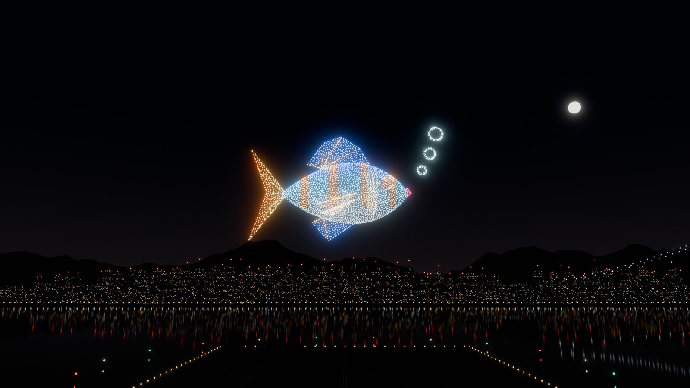

# Studio 13: cinematic sky stage, Blender v2 formations and logic fixes



*Rendered in Blender Cycles from the same formation and stage assets the web app plays (`tools/blender/render_hero.py`).*

## What changed for players

**A real place to perform.** The Demo, **Replay my drawing** and **Show editor** previews now play over a night harbour built in Blender:
- a floating launch deck with edge lights and marker buoys;
- a waterfront skyline with lit windows and blinking roof beacons;
- a lit suspension bridge, layered hills and mountains;
- a moonlit sky with twinkling stars, a faint Milky Way and warm city glow near the horizon.

The water reflects the show and the city. The scenery scales with each show, so a small authored drawing gets the same composition as the 6× Demo.

**Lights that glow.** LEDs are HDR sprites sized in world metres, then rendered through a bloom and filmic tone-mapping pipeline:
- Recordings at 720p look the same as the live view.
- Distant lights keep their brightness instead of flickering.
- White LEDs are capped so they don't burn out.
- Where lights crowd together (dense strokes, contour fireworks), each light dims so the shape stays readable.
- The average colour of the show lights the deck and bridge.
- When the camera is close, each drone shows a quadcopter body with a matching LED dome.

**A director camera.** **Auto camera** (formerly *Front view*) frames each formation large and on screen. It then eases to the next formation as the drones fly:
- Takeoff and landing are seen from above the launch field.
- Formations are seen from below, like an audience, with the skyline beneath them.
- A slow sway reveals depth. Reduced-motion settings turn the sway off.
- Drag to orbit freely. Auto camera then glides back instead of jumping.
- The camera is deterministic: seeking and recording always give the same shot.

**Graphics quality** in **Demo settings**:

| Setting | What you get |
| --- | --- |
| **Auto** (default) | Chosen from the device |
| **Cinematic** | Bloom, 4× MSAA, water reflections, drone bodies, 60 fps cap |
| **Balanced** | Bloom, lighter reflections |
| **Battery saver** | No post-processing, calm shaded water, 30 fps cap |

On every setting, a frame-time governor lowers the render resolution when frames run slow, and raises it again when they recover. It is paused while recording. The HUD shows the active tier.

**Detailed Blender formations (v2).** All seven Demo formations were remodelled:
- **Robot:** waves one hand; has a dark visor with glowing eyes, ears, a heart and chest buttons.
- **Fish:** swimming S-bend; stripes, fins with rays, gills and bubbles.
- **Eiffel Tower:** curved legs, lattice bracing, arches and three decks.
- **Big ship:** lofted hull and red waterline; lit windows, string lights, lifeboats and wake.
- **Firework star:** faceted, with a halo ring and sparkle rays.
- **Row of fire:** twisting flames with white-hot bases.
- **Starship:** steel sheen, panel seams, flaps, engine bells and plume.

Colours are gradients painted into a Blender colour attribute. Lights on surfaces facing away from the audience are dimmed, so silhouettes stay clean from the front, while orbiting still shows the depth.

**Editor polish.**
- The editor has a soft studio backdrop, and its floor and drawing-plane grids fade out instead of ending in a hard square.
- Inspector buttons use a consistent size.
- On phones, the show's formation chips scroll in one row.

## Blender pipeline

Blender 4.5 LTS, run headless. Everything is generated from fixed seeds.

| Script | Creates | Loaded by |
| --- | --- | --- |
| `tools/blender/build_formations.py` | `assets/drone-formations.blend` and `web/src/formation-assets.js` | Demo, lazily |
| `tools/blender/build_environment.py` | `assets/sky-stage.blend` and `web/src/assets/sky-stage.glb` (≈290 KB, Draco) | Sky show, lazily; prefetched when the pointer reaches a show button |
| `tools/blender/render_hero.py` | `docs/media/sky-studio-hero.jpg` (Cycles) | README |

```powershell
blender --background --factory-startup --python tools/blender/build_formations.py
blender --background --factory-startup --python tools/blender/build_environment.py
blender --background assets/sky-stage.blend --python tools/blender/render_hero.py -- --samples 320
```

**Edit by hand:** open the .blend, change it, then export without regenerating:

```powershell
blender --background assets/drone-formations.blend --python tools/blender/build_formations.py -- --export-only
blender --background assets/sky-stage.blend --python tools/blender/build_environment.py -- --export-only
```

**Formation conventions (v2):**
- Formations stand upright (Z-up) facing the audience at −Y. The export converts to app axes, `(x, z, −y)`.
- Keep the seven collection names.
- `fire=True` marks optional falling-fire emitters.
- `emit=False` marks occluders, such as the robot's visor: they hide lights but receive none.
- LED colours come from the `LED` colour attribute; paint it in Vertex Paint. Without it, the material viewport colour is used.

**What the sampler does:**
- area-weighted surface candidates, plus feature-edge candidates so outlines stay crisp;
- drops candidates inside other closed parts;
- weighted farthest-point order, so every fleet size from 256 to 4,096 is evenly spaced;
- bakes audience-facing shading.

Unlike Studio 12, it reads evaluated meshes, so modifiers apply.

**Export format:** int16 positions and uint8 colours, base64-encoded (389 KB, was 1.27 MB). They decode to the same `{body:{positions,colors},fire:{…}}` shape as before, so saved settings and tests keep working.

**Stage conventions:**
- The runtime finds `Drone`, `DroneFrame` and `DroneLED`, and remaps materials by name. Light materials become unlit HDR emitters; hills and mountains become fogged vertex-colour silhouettes.
- If the GLB fails to load, the show still plays over water under the sky, and the HUD says the scenery is unavailable.

## Logic review and fixes

We audited three areas: the editor, the drone show and the Android app. Every fix below either has a unit test or was checked in the browser.

### Web editor

- **Eraser:** no longer cuts or deletes strokes that Focus sheet hides.
- **Erasing on bent sheets:** no longer inflates stroke point counts, which used to hit the 4,000-point budget.
- **Stroke splits:** a split no longer leaves a stray one-point stroke at 384 points.
- **Touch input:** a foreign `pointercancel` (for example, palm rejection) no longer discards the stroke in progress. A three.js OrbitControls crash on untracked pointers is guarded.
- **Performance:**
  - Dragging an image no longer re-uploads its texture on every move; textures are shared and reference-counted.
  - Image payload validation is cached, and a redundant second validate was removed: 9.5 ms → 0.5 ms per move with six maximum-size images.
  - Box selection caches bounds.
- **Import validation:** now rejects empty IDs and more than one Start or Goal.
- **Inspector:** edits made during a shape drag first finish the drag, so they can no longer commit preview state.
- **Shortcuts:** Undo, Delete and tool keys work after touching a slider, checkbox or colour input.
- **Drafts:** the drafts database reconnects if the browser closes it.

### Drone show

- **Renderer:** per-frame work reuses the current frame for trails, and trail tint moves to the shader.
- **Light size:** tracks the viewport and field of view, including the reflection buffer.
- **Crossing paths:** above 256 drones, transfers used to send drones through the same point: 2,030 pairs in "Forming Robot" at 4,096 drones, one at 2e-16 m. A deterministic 2-opt "uncross" pass now runs after a faster quickselect partition. On every 4,096-drone Demo transfer, no pair comes closer than min(start gap, end gap)/√2; the worst Robot pair went from 0.003 to 0.85 units. `compileDemo` costs +11 ms at 4,096 drones.
- **Return home:** drones return to the nearest free pad instead of their original pad, so paths no longer cross and travel is shorter. Each pad still plays its own takeoff exactly in reverse.
- **Falling sparks:** they accelerate, then brake to rest, with no speed jump into the next transfer.
- **Recording:** the bitrate adapts, so long shows fit the 160 MiB budget; shows too long for the bitrate floor (about 22 minutes) are refused up front.
- **Show editor:** Play stays disabled while a preview is being prepared.
- **Show files:** malformed files get readable errors.

### Android prototype

33/33 JVM unit tests pass and the debug APK builds. None of these fixes has been tested on a device yet.

- **Look / gyro:** the rotation matrix is fixed; turning used to roll the image instead of yawing.
- **Crash recovery:** the recovery sketch is no longer overwritten before the Resume prompt is answered.
- **Import safety:** imports catch `Throwable`, so OOM and `StackOverflowError` no longer crash the app, and deeply nested JSON is rejected up front.
- **Studio move forward:** moves forward instead of backward when the view is rotated.
- **Camera permission:** after the permission prompt, AR starts from `onResume`, following the ARCore sample pattern.
- **Image import:** images are rescaled after decoding, so a 2,049 px JPEG no longer produces a file that won't reload.
- **Input and textures:**
  - A two-finger touch no longer fires a tap.
  - The surface flag is read once per stroke.
  - The image texture cache key no longer collides with paper textures.
- **GL resources:** buffers and textures are released on the GL thread.

## Verification

- `cd web && npm test`: **70/70** unit tests, including new ones for:
  - the director camera, graphics tiers and the frame governor;
  - v2 assets;
  - drone separation on every transfer, and nearest-pad landing;
  - recorder bitrate;
  - the editor fixes.
- Android: `.\gradlew.bat :app:testDebugUnitTest :app:assembleDebug` gives **33/33** JVM tests and a debug APK.
- `npm run build` vendors only the three.js add-ons the show uses, found by following their relative imports, plus the Draco decoder. Everything stays local, with no CDN.
- Browser checks in Chrome on an RTX 4080:
  - Demo, Replay my drawing and Show editor previews run on every tier with zero console errors.
  - All tiers render at 60 fps at 1600×960.
  - Portrait phone layout.
- **All 14** browser smoke scripts pass (`web/scripts/*-smoke.mjs`, Chrome with SwiftShader, against the local server).
- Stale checks in the smoke scripts were updated:
  - edition labels (`STUDIO 11` → `STUDIO 13`);
  - `paper-smoke`'s Studio 03 assumptions of v3 export and world-space attached ink. Those two checks already failed on the unmodified code.
- `paper-smoke` no longer overwrites the v3 sample fixture with a v4 file.

## Known limits

- The harbour and bloom are a visual simulation. Flight separation is improved by the path matching but is **not** a safety guarantee.
- Real-phone frame rates (S9+/S22 Ultra) still need measuring. The governor and Battery saver are the safety net.
- `editor-tools-smoke.mjs` rewrites `samples/editor-v2.json` with fresh IDs when run. Restore that file afterwards if you don't intend to update the sample.
