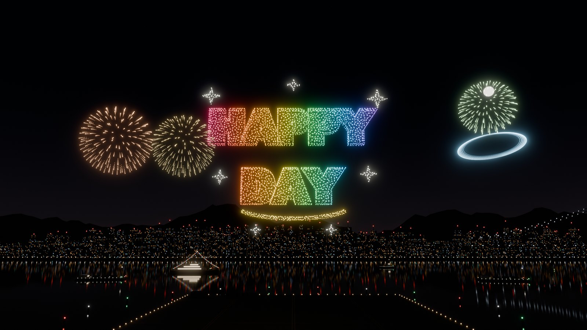

# Studio 14: realistic drones, HAPPY DAY and ship fireworks

*Rendered in Blender Cycles from the shipped formation and stage assets (`tools/blender/render_hero.py -- --formation "Happy day" --fireworks --out happy-day-hero.jpg`).*

## What's new

**Realistic show drones.** Each drone is now a detailed Blender model of a light-show quadcopter:
- rounded shell and carbon arms;
- metal motors with twisted two-blade propellers inside prop guards;
- battery with a strap, GPS mast, antennas, landing gear and an LED pod underneath.

How it behaves in the show:
- **Opening and closing shots:** the Demo opens and ends on a close-up of the front row sitting on their pads, lit by a soft key light that follows the camera.
- **In flight:** drones lean into their direction of travel and the propellers spin, stopping on the pads.
- **Detail levels:** the nearest ~420 drones use the full model (about 4.4k triangles); the rest use a 76-triangle version. Drones beyond about 380 m, which would be sub-pixel, are skipped.
- **LED glow:** the glow tightens up close, so the body stays visible under its light.
- **Reflections:** a night-sky environment map gives the metal and carbon parts believable reflections.

**Four new formations.** Butterfly, Hot air balloon, Birthday cake and **HAPPY DAY**, all modelled in Blender and each with a Show editor line-art version:
- **Butterfly:** Morpho-style wings raised toward the audience, with colour bands, spots and veins.
- **Hot air balloon:** striped gores, load tapes, ropes, basket and burner flame.
- **Birthday cake:** three tiers with frosting drips, sprinkles, and five candles with flames.
- **HAPPY DAY:** extruded 3D letters with a rainbow sweep, sparkles and a smile.

The Demo now runs 5:03 with 11 formations: Robot, Fish, Butterfly, Hot air balloon, Eiffel Tower, Big ship, Firework star, Row of fire, Birthday cake, Starship launch, Happy day. The heart, star and firework-ball drone fireworks and the landing follow.

**Ships on the river.** Vessels float on the harbour and gently bob on the swell:
- two firework barges with mortar racks;
- a party yacht with string lights;
- a tug and three sailboats;
- all with navigation lights.

**Ship fireworks.** The barges and the yacht launch real pyrotechnic shells, with six patterns: peony, ring, willow, crossette, palm and strobe. Each shell has:
- a muzzle flash;
- a rising comet trail;
- a burst flash;
- stars with trails that slow with air drag and droop under gravity;
- strobing and crackle effects.

**When they fire:**
- a salvo and crescendo during HAPPY DAY;
- three shells with each drone firework;
- a finale over the last drone firework.

Turn them off with **Demo settings → Ship fireworks**. Authored shows fire during their Fireworks stage.

**Demo music.** An upbeat 120 BPM soundtrack is generated live in the browser. There are no audio files, so there is nothing to download or license. Each part of the show has its own music:
- **Launch pads:** a soft pad and arpeggio under the opening close-up.
- **Takeoff:** the groove starts, with a crash as the drones lift off.
- **Forming each formation:** a build-up, with a filter sweep, a noise riser and a snare roll. It drops out on the last beat.
- **Each formation appears:** the drop, with a crash and a sub impact, four-on-the-floor kick, clap, offbeat bass, arpeggio and a lead melody.
- **Second half and drone fireworks:** the key lifts a whole step. The heart, star and firework balls peak with a crash on every bar.
- **Falling sparks:** a half-time groove with a falling arpeggio and glittering bells.
- **Ship fireworks:** each shell gets a launch thump and a boom at its exact burst time. Crossettes, strobes and willows also crackle.
- **Landing:** a calm outro that fades out. The show ends on a ringing C-major chord.

**♪ Music** in the player mutes it, and the choice is remembered. Browsers only allow sound after a tap. If a show opens without one, for example from a `#demo` link, the button pulses **♪ Tap for sound**. Recorded videos now include the music as an Opus/AAC track. Authored shows and **Replay my drawing** get the same kind of score from their own stages.

**The Demo starts at the beginning.** Previously the show clock started while the harbour scenery was still downloading and its shaders compiling. On a first visit to the website, part of the opening close-up had already played by the time anything was visible. Now the show:
- holds at 00:00 with **GETTING READY** until the scenery is ready (15 s at most on a stalled connection);
- keeps **Record video** disabled until then, so every video starts on the same opening shot;
- still accepts pause, restart and speed while it waits.

**Open straight into the Demo.** [s0lluxx26.github.io/Draw_in_3D/#demo](https://s0lluxx26.github.io/Draw_in_3D/#demo) opens the Demo as the page loads. Leaving the Demo removes `#demo`, so a reload opens the editor.

## How it works

`web/src/pyro.js` is pure and deterministic:
- **Schedule:** it builds shell timings from the show's stages and the ships' `Pyro_*` launch points.
- **Particles:** it writes one static particle buffer, about 14k particles for the Demo.
- **GPU evaluation:** the vertex shader computes every particle's position from show time using closed-form physics (ballistic rise, exponential drag, gravity), so there are no per-frame CPU updates.

This makes seeking, pausing and recording exact.

`web/src/show-music.js` follows the same approach:
- **Score:** `musicPlan()` turns the stages into musical sections on a 120 BPM grid. The Demo's stages are whole seconds long, so every stage boundary falls exactly on a beat.
- **Events:** `musicEvents()` returns every note in a time window. Adjacent windows never repeat or skip a note, and ship-firework booms use the same `pyroSchedule()` timing as the particles.
- **Playback:** `ShowMusic` schedules notes 0.35 s ahead of the show clock with Web Audio. Each playback run gets its own buses:
  - pause, seek, restart or a speed change cancels what was queued and continues from the new time;
  - held chords resume mid-note after a seek;
  - output latency is compensated, so booms reach the ear with their flashes.
- **Mix:** a limiter prevents clipping, and a convolution reverb, an echo and sidechain-style pumping make it sound full.

`evaluateParticle()` mirrors the shader on the CPU for tests.

Other runtime details:
- **Shader precompile:** the stage compiles all its shaders in the background (`compileAsync`) before hiding the loading pill, so the first close-up doesn't stall. Before this, Direct3D stalled for seconds.
- **Software rendering:** SwiftShader and llvmpipe now select Battery saver automatically.

## Blender pipeline additions

- **`build_environment.py`:**
  - **Drone:** `build_drone()` makes the detailed drone (`DroneFrame` with four materials, `DroneProps`, `DroneLED`) and the far-LOD `DroneLow`.
  - **Ships:** `build_ships()` makes the vessels as `Ship_*` nodes and their launch points as `Pyro_*` empties. The runtime bobs the ships and launches from those points.
  - Moving a ship in Blender moves its fireworks.
- **`build_formations.py`:**
  - Adds `butterfly()`, `balloon()`, `cake()` and `happy_day()`.
  - HAPPY DAY uses a Blender text object with Arial Black when available, and Blender's built-in font otherwise.
  - Per-formation seeds are now keyed by name, so adding formations never reshuffles existing ones.
- **`render_hero.py`:** new `--formation`, `--fireworks` and `--out` options.

## Verification

- `cd web && npm test`: **79/79**, including:
  - ship-firework determinism, launch points, timing and finite paths (`pyro.test.mjs`);
  - the director close-ups;
  - software-renderer tiering;
  - the new formations in both demos;
  - pyro flags in both demos;
  - the music score (`show-music.test.mjs`): sections on stage boundaries and beats, a drop on every formation arrival, exact once-only scheduling across any window split, booms at burst times, pause, seek, speed, resume and end behaviour, and a valid Web Audio graph for every voice.
- All browser smoke scripts pass. `drone-show-smoke` covers every cue of the 11-formation demo.
- With the scenery download delayed by 5 s, the show holds at 00:00 (**GETTING READY**, Record disabled) and starts from 0 once it arrives. `#demo` opens the Demo, and leaving it restores the editor and the plain URL.
- `show-editor-smoke` downloads a recording that contains both VP8 video and an Opus music track.
- In Chrome on the RTX 4080 the show held about 50–60 fps across tiers. This machine's GPU was shared with other work, so individual runs varied.

## Known limits

- Show-editor `.show.json` files don't store per-cue ship-fireworks flags yet. Authored shows fire during their Fireworks stage.
- The music is synthesised, not a produced track. At 0.5× and 2× it plays slower or faster at the same pitch. Safari may need one tap on the page before sound starts.
- Drone separation is improved by path matching but is not a safety guarantee.
- Real-phone performance still needs measuring on the S9+ / S22 Ultra.
