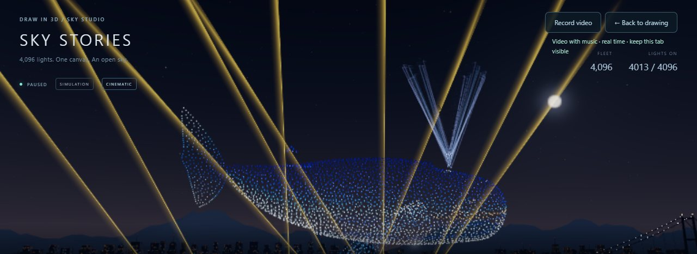

# Studio 15: phone-friendly show, whale, flapping butterfly and lasers

## What's new

**The show gets the screen on phones.** Before, on a phone in portrait, the title block, buttons, recording hint and fleet counters covered the top quarter of the screen, and the controls took another third. In landscape the bottom panel grew over everything. Now, on screens up to 560 px wide or 500 px tall:

- **Editor header:** hidden while the show plays.
- **Top bar:** one slim row with the title and status on the left, **Record video** and **Back** on the right. The recording hint appears only while something is happening, such as recording progress or an error.
- **Bottom panel:** one compact panel with the formation name and time, a swipeable cue strip, the seek bar, and one row of buttons. Pause, restart, music, settings and auto camera show as icons, with names kept for screen readers.
- **Landscape:** the formation name sits beside the cue strip, so the sky keeps about two thirds of the height.
- **Framing:** the automatic camera centres each formation between the top bar and the bottom panel.

In portrait the covered area went from about 550 px to about 210 px of a 915 px screen.

**The camera stays around the show.** Dragging and pinching now adjust the view *relative to* the automatic camera:

- the camera keeps following each formation, so a stray swipe can't leave you staring at empty sky;
- angles stay within about 55° either side;
- the view goes from slightly below to well above the formation;
- zoom stays between 0.4× and 1.8×;
- **Auto camera** still returns to the cinematic view.

To orbit freely as before, set **Demo settings → Camera when you drag → Free orbit**. The choice is remembered.

**Formations stay up longer.** Each Demo formation now holds for about 12 seconds instead of 8–9. The Whale gets 15 s, Starship 17 s and HAPPY DAY 16 s. The Demo runs 6:05 with 12 formations.

**The butterfly flaps its wings.** The wings turn about the body, tips toward the audience and back, about ±23° at 0.55 Hz. The motion eases in and out, so it joins the transfers smoothly. In the Show editor this is the **Wings flap** effect.

**A whale, with a split water spout.** A humpback modelled in Blender joins the Demo after the Big ship:

- **Model:** a blunt head, a deep-blue back and a white grooved belly, long white pectoral fins, horizontal flukes, an eye and a mouth line.
- **Swimming:** a slow vertical wave travels from head to flukes, with the flukes beating most.
- **Spout:** a tenth of the fleet becomes a water spout from the blowhole. It shoots up, splits into two jets that fan out and droop, sprays for a few seconds, fades, rests and blows again, about every 4.6 s.

In the Show editor this is the **Swim** effect; the editor version has no simulated spout.

**Stage lasers.** Ten beams rise from the back of the launch deck, behind the formations, and follow the music sections:

- **Takeoff:** a soft tunnel as the drones take off.
- **Build-ups:** slow sweeps that brighten.
- **Formation drops:** fans, crisscrosses or waves that pulse on every beat and change colour every bar.
- **Drone fireworks:** fast rainbow crisscrosses.
- **Falling sparks:** sinking beams.
- **Close-ups and landing:** the lasers rest.

The beams blank around each cue change like a real laser show, and the water reflects them. Turn them off with **Demo settings → Stage lasers**.

## How it works

**Motion in the show engine.** `sampleShow()` adds formation motion on hold stages (`stage.motion`: `flap` or `swim`):

- **Deterministic:** the motion is a pure function of show time, like the rest of the choreography, so seeking, trails and recordings stay exact.
- **Easing:** an envelope eases the motion in over the first 1.2 s and out over the last 1.2 s of the hold.
- **Bounds:** motion bounds come from the formation itself, so authored shows get the effects too.

**The spout** is simulated by the app. `compileDemo()` gives the whale `floor(count/10)` droplets:

- each droplet has a position along its jet, a jet side and a spray offset (`spoutDrop()`);
- `spoutPoint()` places a droplet on the V-shaped jets from the blowhole;
- during the hold each droplet flows up its jet, and `blowGlow()` lights the rising front of each blow;
- the blowhole is `WHALE_SPOUT.hole = [7.4, 1.538, 0]`, printed by `whale_blowhole()` in `tools/blender/build_formations.py`.

**The whale model.** `build_formations.py` adds `whale()`, with `NAMES` and `SEEDS['Whale'] = 11`:

- rebuilding re-samples every formation, and farthest-point ordering amplifies tiny floating-point differences into a different point order;
- so only the new Whale was merged into `formation-assets.js`, and the other 11 formations stay byte-identical;
- the rebuilt `assets/drone-formations.blend` includes the whale.

**Lasers** live in `web/src/lasers.js`:

- **Cues:** `laserBeam()` is pure and cued by `musicPlan()`, so beams and music change together.
- **Rendering:** `LaserRig` draws each beam as a camera-facing additive HDR ribbon. It is wide enough never to break into sub-pixel dots under bloom.
- **Wiring:** `show.lasers === false` turns the rig off.

**The follow camera.** `DronePlayer.follow()` moves the orbit target (and the camera with it) to the director's target every frame, then sets the OrbitControls azimuth, polar and distance limits around the director's pose. `CAMERA_MODES` are `follow` (the default) and `free`, stored as `draw3d-camera-v1`.

## Verification

- `cd web && npm test`: **83/83**. The new `formation-motion.test.mjs` checks:
  - butterfly wing tips swing while the body stays still;
  - no jump at hold boundaries;
  - droplets rest on their jets and flow exactly along them;
  - flukes beat far more than the head, and the blow cycle rises, sprays and rests;
  - the whale's fire excludes the spout;
  - editor round-trips keep `flap` and `swim`;
  - lasers are dark for close-ups and landing, blank at every cue, pulse on drop beats, never aim below the horizon, and are deterministic.
- All 14 browser smoke scripts pass; `drone-show-smoke` now visits the Whale cue.
- **Phone layout** (412×915 and 915×412): no scrolling, and the top bar ends at 50 px. The bottom panel starts at 757 px in portrait and 294 px in landscape.
- **Camera limits:** after a wild drag and 12 zoom-outs, "Stay around the show" still frames the Robot and then the Whale. Free orbit loses them to the horizon, as before.

## Known limits

- The whale always faces +x. An authored whale drawn facing the other way still swims, but the wave runs tail to head.
- The editor's **Swim** effect has no spout, because authored drawings have no blowhole.
- Shows can now hold 14 formations, up from 12, so **Edit demo** still has room for two of your own after the Whale. The longest possible show still fits the recording budget.
- Real-phone performance (S9+ / S22 Ultra) still needs measuring, with the lasers and the longer Demo.
