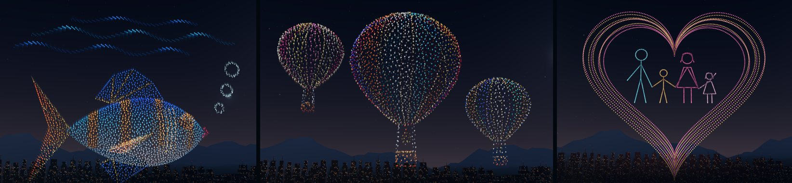

# Studio 16: edit the Demo, swimming fish, three balloons, a family in the heart

## What's new

**Edit the Demo, save it, play it later.** **Show editor → Edit demo** now opens the Demo itself, as set up in **Demo settings** on this device:

- the 12 Blender-built 3D formations with their motion (cards marked **3D**);
- the Demo's look: lights, size, ship fireworks and lasers;
- the Demo finale: the heart with the family, the star and the firework balls.

To make it yours:

- remove, reorder or retime formations;
- switch falling fire on or off;
- add your own drawings or more Demo formations (**＋ Demo formation…**);
- change the look, or choose the classic fireworks finale.

**Save show** writes a small `.show.json` (about 3 KB for the whole Demo) that stores your choices, not drone positions. Later, **Open show** lets you keep editing, and **Play my show** performs it just like the Demo, with your changes.

- **Change a formation's shape:** choose **Convert to drawing**. The formation becomes its editable line art and keeps its timing and motion; Undo restores the 3D formation.
- **Your own drawings** play on the Demo stage at the same scale as the Demo formations.
- **Older show files** still open and play as before. **Look → Use the Demo's look** upgrades them.

**The fish swims.** Its body swings side to side, the tail most, while it rises and dips a little, nose first. Above it, an eighth of the fleet forms three rolling swells of the sea surface. The waves travel toward the tail, with foam-white crests and deep-blue troughs.

**Three hot air balloons.** One big balloon flies between two smaller ones, each with its own colours, basket, ropes and burner flame, modelled in Blender. During their display the balloons drift gently up, about 21 m. Each sways on its own, and the burner flames flicker. The next transfer starts from where they rose to.

**A family in the growing heart.** Inside the heart stand a man, a boy, a woman in a dress and a waving girl, holding hands, each in their own colour. The figures use about 28% of the fleet and grow with the heart.

**Record video saves a file you can play and seek.** **Record video** plays the show from takeoff at 1× and records 1280×720 video with the music. When the show ends it downloads `draw-in-3d-show.webm` (`.mp4` in Safari). The full Demo gives a file of about 100 MB after 6 minutes.

Chrome's recorder leaves the length out of WebM files, so players showed no duration and could fail to seek. Studio 16 writes the length into the file header before the download.

**Clicks after typing no longer get lost.** In the Show editor, clicking another card right after typing a value re-drew the card list mid-click. The click was dropped, so the next edit went to the previous formation. Cards are now updated in place.

## How it works

**Show format version 3.**

- **Demo formations:** a cue can name a Demo formation (`library`, plus an optional `fire`) instead of storing artwork.
- **Look and finale:** `look` holds the light shape, size, ship fireworks and lasers, and `fireworks.style` is `demo` or `classic`.
- **Compiling:** `compileShow(doc, assets)` builds Demo formations with the same `libraryFormation()` the Demo uses, now in `web/src/demo-library.js`. It scales drawings by the Demo's stage scale and applies the Demo's transitions, landing, camera and look.
- **Tests:** an edited Demo with no changes compiles to exactly the same show as the built-in Demo (same stages, positions, motion, fire and length).
- **Older versions:** version 1 and 2 files compile as before.

**Fish waves** (`FISH_WAVES`, `waveDrop`, `wavePoint`, `waveGlow`) and the **whale spout** share one "extra drones" mechanism (`formation.extra`). It is pure and time-based, so seeking and recording stay exact.

**Balloons** are a `rise` stage like the Starship's, 3.5 units, with a `balloons` motion for the sway and the flame flicker. The Blender layout is `BALLOONS` in `build_formations.py`; only the Hot air balloon asset was regenerated.

**The family** is `familyPaths()` in `drone-show.js`: stick figures sampled along their lines, all inside the heart's innermost contour.

**WebM duration.** `withWebmDuration()` reads the first 64 KB of the recording and inserts `Segment > Info > Duration`. The video data is reused as Blob slices, not copied. Anything unexpected (a SeekHead, an existing duration, a non-WebM file) leaves the recording as it was.

## Verification

- `cd web && npm test`: **93/93**, including:
  - `demo-show-editing.test.mjs`:
    - an edited Demo with no changes equals the Demo;
    - edits play as edited (order, removal, timing, fire, look, finale);
    - Convert to drawing works, and Undo restores the 3D formation;
    - drawings and Demo formations share one stage at the same scale;
    - old shows upgrade;
    - bad files are rejected.
  - New cases in `formation-motion.test.mjs`:
    - fish waves travel, and their crests glow;
    - the tail swings more than the head;
    - the balloons rise, sway and flicker, and the next transfer starts from the raised balloons;
    - the family sits inside the heart;
    - WebM duration writing.
- **Browser tests:** the new `demo-editing-smoke.mjs` runs the whole workflow in Chrome: edit the Demo, save, start a new show, reopen and play the edited Demo, with no browser errors. `show-editor-smoke` (including a real recording) and the other smoke scripts pass.
- **Recording:** the full live Demo recorded on an RTX 4080 downloaded a 99.8 MiB WebM with VP8 video and Opus music. With the duration written, Chrome reads 365.8 s, 1280×720, and seeks to 3:20.

## Known limits

- Demo formations keep the Demo's placement; convert one to a drawing to move or reshape it.
- The editor's thumbnails show Demo formations' still shape; motion and waves appear when the show plays.
- Real-phone performance (S9+ / S22 Ultra) with the longer Demo still needs measuring.
