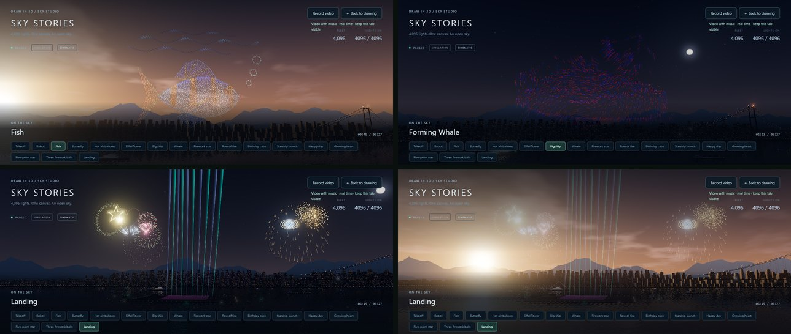

# Studio 18: late afternoon, drones you can watch fly, a firework finale, and an editor built for Run

## What's new

**Choose the background: Dark night or Late afternoon.** **Settings → Background** switches it live, for the Demo and for your own shows, and this device remembers it.
- **Late afternoon** is a golden hour: the sun sits low behind the harbour, with warm clouds and hazy hills.
- The sky stays deep enough that the drone lights still stand out.
- A soft shade behind the title keeps the text readable.

**See the drones move between shapes.** Before, the navigation blinks during a shape change were so faint (under 1% of an LED's full light) that the drones seemed to vanish. Now:
- every drone blinks **red or blue at a quarter of full light** (25%) while it flies, so you can follow the fleet regrouping;
- the finished shape fades out before the flight, and the new shape lights up from dark when it arrives.

**Longer shapes, quicker changes.** Every Demo formation holds 3 s longer: 15 s, and the Whale 18 s, Starship 20 s and Happy day 19 s. Shape changes take 7 s instead of 9 s. New drawings in a Demo-style show get the same 15 s / 7 s.

**A firework finale while the drones land.** The landing is 20 s instead of 14 s, and the drones rest on their pads for 8 s instead of 4 s. The Demo now runs 6:27. While the fleet comes down, the ships fire:
- rolling salvos of mixed shells;
- **shaped fireworks that open toward the audience**: hearts, stars and Saturn rings;
- a **wall of every kind of shell at once**;
- a willow curtain as the drones touch down.

During the landing, the camera pulls back to a wide harbour view, with the fireworks above and the landing field below. The music builds on the flight home and peaks under the fireworks. The lasers sweep throughout, and the landing ends on the launch-pad close-up. If ship fireworks are off, the landing stays as it was.

## The Show editor, designed for Run

The editor is where you shape a show, and Run is where you check it. They should never disagree, and moving between them should keep your place. An audit compared what the editor shows with what Run plays, and found one real mismatch: **Bottom to top** reveal. At the Demo's 6× scale, every light waited 1.5 s and then appeared at once. That is fixed. The editor now follows six rules.

1. **One compile path.** The large preview is the formation exactly as Run plays it (`cueSequence()`, the same function Run compiles with). It includes the whale's spout, the fish's waves and falling fire. The note counts them: "3,687 lights · 409 in the spout".
2. **One clock.** Card times (`0:30 → 0:37 · hold 15s`) and the show length (`6:27`) use the player's format. Tests check that each card's times equal Run's.
3. **Keep your place.**
   - **▶ Run from here** starts the show as the selected formation begins to form.
   - **← Back to show** selects the formation that was on screen, so your next edit is on what you just watched.
4. **Problems show on the card, not at Run.** A formation with nothing drawn, or with ink outside the sky stage, gets a ⚠ card saying why. **Play my show** selects it instead of failing part-way through preparing.
5. **Controls that don't apply say so.** A rising formation (Starship, balloons) lights up as it rises, so its Light reveal is disabled and the tooltip explains why. Converting a Demo formation that had falling fire explains how to add fire to a drawing.
6. **Show look vs. viewing options.** The show's look is saved in the show file and set in the editor: lights, size, ship fireworks, lasers and finale. Viewing options apply to every show and are set in Settings: quality, camera and background.

**Still open:**
- The editor's preview is a still front view. A small live 3D view with motion would be the next step.
- A drawing has one Motion / effect slot, so it can swim *or* have falling fire. Demo formations can have both.
- Demo formations keep their placement; convert one to a drawing to move it.

## How it works

- **Travel blink** (`drone-show.js`): in shows with lit transitions, `sampleShow` gives each flying drone the red/blue navigation blink at `TRAVEL_BLINK`, 25% of an LED's full light. Frame colours are gamma values (the LED shader raises them to the power 2.2), so that is a colour value of `TRAVEL_LEVEL` = 0.25^(1/2.2) ≈ 0.53. The old blink was a value of 0.12, under 1% of full light. Displays fade to dark before a move and reveal from dark after it, so every boundary stays continuous. Older shows keep their transitions.
- **Bottom to top** now ranks by height in stage units (`y / motionScale`), so it sweeps at any scale.
- **Timing:** `DEMO_TRANSFER` (7 s) and `CINEMATIC_LANDING` (9 s return, 20 s descent, 8 s rest) feed the Demo, `demoCue()`, `DEMO_TIMING`, `showDuration()` and the editor's timeline, so they cannot drift apart.
- **Finale** (`pyro.js`):
  - The landing stage schedules 39 shells. Shaped shells (`SHAPES`) keep their outline: star speeds follow the shape rather than being normalised, and every star shares one life.
  - `show-music.js` adds the `homebound` (build) and `finale` (peak) moods, and merges booms that land within 60 ms, so the wall hits once, fuller.
  - `lasers.js` sweeps in both moods.
  - `show-camera.js` frames the harbour sky for the return and the descent.
- **Background** (`sky-stage.js`): `BACKGROUNDS.night` reproduces the original harbour exactly. `afternoon` changes all of these:
  - sky colours, a sun disc and corona, and clouds;
  - fog, water, hemisphere and key light;
  - a matching reflection environment (one PMREM per background);
  - the window glow and the hills.

  `SkyStage.setSky()` applies a background live. `DronePlayer.setSky()` stores it under `draw3d-sky-v1`.

## Verification

- `cd web && npm test`: **98/98**. The new `run-mode.test.mjs` checks:
  - each card's times equal Run's;
  - the editor's preview formation equals Run's, water included;
  - card problems;
  - Bottom to top sweeps from the bottom at Demo scale;
  - the landing finale has every kind of shell, a wall of at least 12 together, and every shell burnt out before the end;
  - the camera frames bursts and field together, but not when ship fireworks are off;
  - shaped shells are flat outlines facing the audience.

  Updated tests cover the transitions: only red or blue LEDs in flight, never above 25%, alternating colours, and continuity at every boundary. They also cover the new durations (Demo 387 s), the finale moods and the merged booms.
- **Browser tests:** `demo-flow-smoke.mjs` now also checks:
  - Late afternoon applies live from Player settings;
  - **Run from here** starts at the card's time;
  - **Back** selects the formation that was playing;
  - a blank card is flagged and blocks Run.

  All 16 smoke scripts pass.
- **Real GPU** (RTX 4080 SUPER): both backgrounds render at a formation, mid-transition and during the finale, with no page errors.
