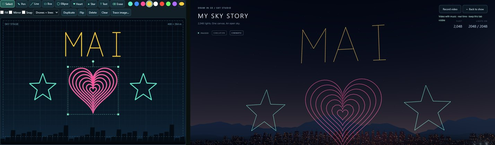

# Studio 19: design drone formations in 2D

## Why

The Show editor could already arrange a show: storyboard cards, timing, effects, Run, save and open. Drawing a formation was the weak part. **Edit drawing** sent you out to the full 3D drawing workspace, which was built for AR drawing on sheets in space, and the stage in the middle was only a still picture. The Unity reference project (Drone Star Studio) showed the layout a drone-show designer wants: the cues on the left, the stage in the middle, the inspector on the right and the timeline below. Studio 19 turns our stage into that designer.

## What's new

**The stage is the formation designer.** It shows the whole playable sky, 408 × 264 m in the Demo look, as the audience sees it, with the harbour skyline along the bottom. Every line becomes a line of drones in its colour, and the dots are the drones that Run flies to.

- **Draw:**
  - **Pen** draws freehand and smooths the line.
  - **Line**, **Box**, **Ellipse**, **Heart** and **Star** draw by dragging; Shift gives equal sides or 15° steps.
  - **Text** uses a single-stroke font for A–Z, 0–9 and `! ? . , - + ' : ♥`. Accents fold away: Hà Nội → HA NOI.
  - **Erase** removes lines.
  - Pick one of eight colours or any colour.
- **Design aids:**
  - **Fill** turns a shape into concentric rings of drones.
  - **Mirror** draws both halves.
  - **Snap** keeps to a 1-unit grid.
  - **Trace image…** puts a picture behind the stage to draw over. It isn't saved.
  - **View** switches between drones and lines, drones only, and lines only.
- **Adjust with Select:**
  - Click a shape: a filled shape, a word or a mirrored pair comes as one piece. Alt-click picks a single line, Shift-click adds to the selection, and a box drag selects an area.
  - Drag to move, drag a corner to resize, drag the knob to rotate.
  - The arrow keys nudge, and a colour recolours the selection.
  - **Duplicate**, **Flip**, **Delete**, **Clear** and Ctrl+A work on the stage. Every change is one Undo step.
- **Live drones:** while you draw or drag, the dots follow the lines. The note counts the lights, water drones and lines, and gives the spacing, for example "a drone every 0.69 m".
- **From the designer to the sky:** **▶ Run from here** plays the show as the drones fly into your drawing, and **← Back to show** returns to it.
- **Demo formations and older drawings:**
  - **✎ Convert to drawing** puts a Demo formation's line art on the stage, water included.
  - Ink from the 3D workspace shows as it will play. **Flatten into the designer** makes it 2D-editable; **Edit in 3D workspace** keeps its depth.
  - **＋ Draw a formation** no longer leaves the Show editor.

## How it works

- **Ordinary ink, exact mapping** (`formation-design.js`): a designed formation is one hidden 3.4 m sheet plus sheet strokes, at a fixed placement where sheet point (u, v) is stage point (20u, 20v + 24). The sheet covers exactly the stage, x −34…34 and height 2…46. Show files, Run, drafts, undo and the 3D workspace read it unchanged, so there is no new file format.
- **Checking a formation:** `isDesign()` decides whether the designer can edit a formation. Sheet sizes are stored in single precision, so it compares with a tolerance, and a saved show reopens editable.
- **Flattening:** `flattenArtwork()` flattens any other drawing exactly where Run places it; a test checks that the drones don't move.
- **Converting:** `drawingCue()` (Convert to drawing) and a blank `newCue()` now create designer drawings directly.
- **Geometry** is pure and tested:
  - shape outlines fitted to the drag box;
  - concentric fills that stay inside the outline;
  - the stroke font;
  - pen simplification, capped at the 384-points-per-line limit;
  - hit tests, move, scale, rotate, mirror and fit;
  - the per-formation budget of 79 lines and 4,000 points, which the designer enforces with a clear message.
- **The designer** (`formation-designer.js`) is a canvas with pointer and keyboard handling.
  - Each edit becomes one Show-editor change, so undo, drafts and Save behave as before.
  - Lines drawn in one action share a group for this session. For files, a closed outline also picks up the same-colour lines inside it.
  - While you drag, a lighter sample of up to 2,048 drones follows the lines. When you let go, the exact formation (`cueSequence()`, the same function Run uses) replaces it.

## Verification

- `cd web && npm test`: **104/104**. The new `formation-designer.test.mjs` checks:
  - the sheet covers exactly the stage;
  - drawn shapes become drones in place and colour, and ink past the edge is cut off without an error;
  - new, converted and saved formations are designer drawings;
  - a 3D-workspace drawing flattens without moving a drone;
  - shapes fit their boxes, fills stay inside, and Shift draws circles;
  - the font, folding and centring;
  - hit tests, transforms, simplify, the budget, and a designed formation playing in a Demo-style show.
- **New `designer-smoke.mjs`** runs the whole designer in Chrome:
  - a blank stage;
  - a filled heart, text, a pen line and a mirrored line;
  - selecting the heart as one shape, deleting and undoing it, moving, nudging, select-all and delete, then Ctrl+Z;
  - Run from here and back;
  - saving, starting a new show, and reopening the file, still editable;
  - converting the Demo Whale with its spout;
  - the phone layout;
  - no browser errors.
- `show-editor-smoke` and `demo-flow-smoke` follow the new flow: a formation is drawn on the stage, and Convert then Edit in 3D workspace opens the workspace. **All 17 smoke scripts pass.**
- **Real GPU** (RTX 4080 SUPER): the formation above, designed with the tools and performed by 2,048 drones, with no page errors.

## Known limits

- The stage has no zoom yet. At 4,096 drones the dots sit about 1.5 px apart, so they read as lines; a smaller fleet shows separate dots.
- The designer is 2D. Flattening a curved-sheet drawing drops its depth; keep depth with **Edit in 3D workspace**.
- Groups made while drawing last for the session. After reopening a file, a filled shape still selects together, but a word selects letter by letter (use a box selection).
