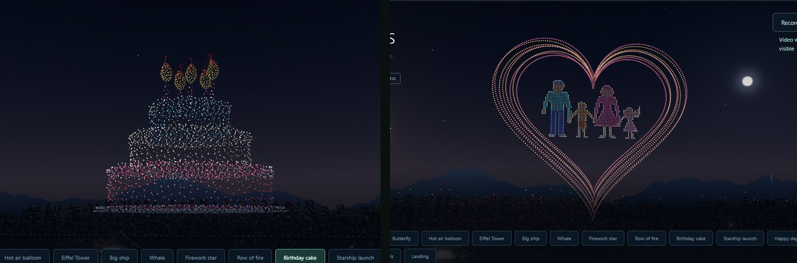

# Studio 20: candles that burn, a family you can recognise

## What's new

**The birthday cake's candles have flames.** Each of the five candles now carries a bright teardrop flame, white-hot at the base and yellow to orange at the tip. During the display the flames dance and flicker, each on its own. Before, the flames were in the Blender model but only about 7 of the 4,096 lights landed on them, so the candles looked unlit. Now about 175 do, roughly 35 per flame. Smaller fleets keep the same share: 23 flame lights at 512 drones.

**The family in the growing heart is drawn as people, not sticks.** The man, the boy, the woman and the waving girl are filled silhouettes, holding hands:
- faces, and hair: short, long, or in pigtails;
- rounded shoulders and sleeved arms, with hands that meet;
- a shirt with trousers or shorts, or a dress;
- legs and shoes.

Each person keeps their own colours, with lighter faces. The outlines are a little brighter so each figure reads against the heart. They still use 28% of the fleet, and they still grow and fall with the heart.

## How it works

- **Candle flames:**
  - `build_formations.py` gains a per-part `density` sampling weight. A denser part gets proportionally more candidate points and a larger farthest-point weight, so its lights sit closer together. Parts at the default weight of 1 sample exactly as before.
  - The candle flames use weight 2.4 and are a little larger: 2.9 tall instead of 2.3, 0.72 wide instead of 0.55.
  - Only the Birthday cake was taken from the new build; the other 11 formations in `formation-assets.js` are byte-identical.
- **Flicker:** a new `candles` motion (`drone-show.js`) moves and dims the warm-coloured lights in the formation's top 14%, above the candles, so the sprinkles and the white-hot flame bases stay still. The lights of one flame share a phase, so each flame dances as one. Drawings can use it too: **Motion / effect → Candle flames flicker**.
- **Family:** `familyFigures()` builds each person from layered parts: hair, legs and shoes, arms and hands, shirt or dress, shoulders, neck, then face and hair on top. It samples their union on an even grid sized for exactly the family's share of lights. Rim points come first and are brightened, so the silhouettes stay crisp at any fleet size.

## Verification

- `cd web && npm test`: **104/104**.
  - The family test still checks that every family light sits clearly inside the heart's innermost contour, in four colours, as a row of standing figures.
  - The effect round-trip test now includes the cake's `candles` motion.
- The Demo, Demo settings, Demo ↔ editor, Demo editing, designer and Show editor smoke tests pass.
- **Real GPU** (RTX 4080 SUPER): the cake at 3:42 shows five burning candles, and frames 0.4 s apart show the flames moving. The heart at 4:58 shows the four figures.
