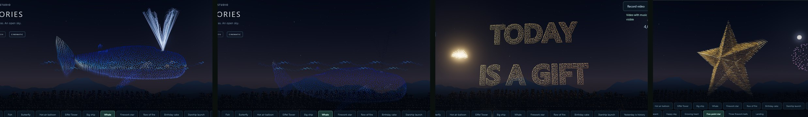

# Studio 22: a whale that swims and blows, a spinning 3D star, readable words

## What's new

**The whale swims through the sea.** Two rolling sea lines now run through the whale:
- It swims in 6 s strokes, rising nose-up and diving nose-down, with the body wave running to the flukes.
- Each time its blowhole breaks the surface, it **blows its split spout**. The jet climbs out of the blowhole and sprays, then dies away as the whale dives.
- Whatever is under the sea glows a dim deep blue, so you can see it swimming in and out of the water.
- Whale drawings (**Swim (whale)**) swim the same way and blow on a timer, since they have no sea.

**The five-point star is 3D and spins.** It's now a faceted gold star with a front and a back peak, bright ridges and shaded facets.
- It makes **one smooth full turn** while it grows and during a new 4 s spin, twinkling as it goes.
- Because the turn is a whole one, it falls into sparks from exactly where it grew.
- Star-shaped fireworks, double rings and a crown burst around it.

**The sentence reads clearly.** The phrases (YESTERDAY / IS HISTORY … THE / PRESENT) now use thinner, lighter letters (Segoe UI Semibold instead of Arial Black) in brighter colours, with shallower depth. The drones draw clean letter shapes rather than thick blobs.

**More fireworks during the sentence.** Each phrase now gets three shells: a showpiece as it forms (chrysanthemum, crown or double rings), a classic burst, then a shaped heart, star or Saturn shell.

**Show editor fixes** (found in a full walk-through):
- **Convert to drawing** on Happy day keeps only HAPPY DAY's own 16 s display. Before, the line-art HAPPY DAY inherited the whole 46 s, sentence included.
- If Happy day's display is shortened too far for the sentence (below 21 s), HAPPY DAY plays on its own. Before, the phrases were squeezed to a flicker. A moderately shorter display still plays the whole sentence, just faster.
- The Whale's note now counts its spout and its sea separately ("409 in the spout · 341 in the sea").
- Undo and Redo say **Undone.** and **Redone.**

The walk-through also checked every card, Run from here, Back during a phrase, the designer on converted drawings, save and reopen, and the phone layout. The editor's and the player's show lengths match everywhere.

The Demo runs 7:03.

## How it works

- **Whale** (`drone-show.js`): `WHALE_SEA` gives the whale two wave lines, a twelfth of the fleet, alongside its spout, which is a tenth. `swimPose()` computes the stroke once per frame:
  - a rise-and-dive with pitch, eased in and out, so the transfers stay continuous;
  - with a sea, the time since the blowhole surfaced, which gates the spout's jet front.

  Body lights below the top sea line are dimmed and tinted blue.
- **Star:** `starSolid()` samples the ten facets and the ridges of a 3D star (Halton points, then farthest-point sampling, shared with the heart). A `spin` turn goes from 0 to 2π over the grow and spin stages with a smooth ease, so the grow → spin → fall boundaries stay continuous. `STAR_SPIN` (4 s) is added to `DEMO_FINALE`.
- **Letters:** `PHRASES` in `build_formations.py` now use Segoe UI Semibold, with extrusion 0.12, bevel 0.02, depth ×1.2 and brighter colour stops. Only the five phrases were merged into `formation-assets.js`; the 12 formations are byte-identical.
- **Fireworks:** three shells per phrase, and shells around the spinning star. The particle budget is now 50,000, up from 40,000; a particle that isn't burning costs nothing to draw.

## Verification

- `cd web && npm test`: **108/108**.
  - **Whale test (rewritten):**
    - spout and sea drone counts;
    - it rises and dives by more than 12% of its length;
    - the spout is lit only while the blowhole is above water;
    - its head breaks the surface, then dives;
    - what is under water is dimmer.
  - **Star test:** a 3D star with over 6 units of depth, bright ridges and shaded facets. It is turning mid-spin, and back where it grew at the end.
  - **Editor fixes:** converting Happy day keeps 16 s; a 12 s Happy day plays without the sentence; a 30 s one keeps all five phrases, and the lengths agree.
  - Every phrase gets three shells.
- A browser walk-through of the Show editor (every card, Run from here, Back, converting, designer, save/reopen, a short Happy day, phone) found no problems besides the two notes above.
- All smoke scripts pass. **Real GPU** (RTX 4080 SUPER): the whale surfacing and blowing, then diving; the phrases; and the star spinning. No page errors.
