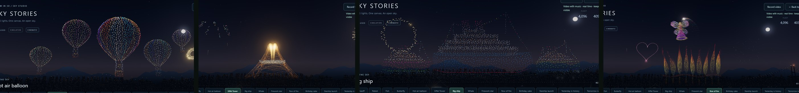

# Studio 23: fireworks all through the show, a growing Eiffel Tower, five balloons, an escorted liner and a flying princess

## What's new

**Fireworks all through the show.** Ship fireworks used to fire only around Happy day, the sentence and the finale. Now every formation has them, 143 shells in all (up from 85):
- every formation is welcomed with a pair of shells;
- the balloons drift up among soft bursts, and the Starship launches among crackling ones;
- the scenes below get their own displays.

**A growing Eiffel Tower.** Like the growing heart, the tower now *grows*:
- The drones fly in and gather in a small patch at its foot.
- The tower rises from the bottom up over 6 s. Each light comes on as its drone climbs, and a glowing band marks the rising edge.
- It then turns gently to show it's 3D.
- Palm and crown fireworks rise with it, and a wall of shells fires the moment it stands complete.

**Five hot air balloons.** A big balloon in the middle, two medium ones and two small ones, each in its own colours, with its own sway and a flickering burner.

**The big ship has two escorts.** A smaller ship sails on each side of the liner, one with a pink hull and one with a green hull. The ships salute with eight fireworks.

**The row of fire waves, and a princess flies.**
- The flames rise and fall in a travelling wave along the row.
- A **fairy princess** (gown, tiara, long hair, a star wand and two pairs of butterfly wings) flies a slow loop around and above the fire. She banks into the turns, flaps her wings, and her wand sprays a trail of sparkles that spread, fall and fade behind her.
- Hearts, stars and showpiece fireworks burst around her.
- She uses about a third of the fleet, and she rests in the middle, in a halo of sparkles, at the start and end of the scene.

## How it works

- **Blender** (`build_formations.py`):
  - `BALLOONS` has five entries.
  - `ship()` adds two scaled copies of the finished liner (by object transform, since `mesh_data()` samples in world space) with recoloured hulls.
  - `princess()` and `princess_wings()` are two new companion assets (body only). Keeping the wings separate lets the player flap exactly the wing lights.
  - Only the changed and new entries were merged into `formation-assets.js`; the other formations are byte-identical. The asset is now 988 KB.
- **Growing formations** (`drone-show.js`):
  - A `grows` library cue flies to index-aligned seeds, the finished positions squeezed to a patch at the foot.
  - Its display stage then brings each light up by height, lit once it has risen part of the way, with a sparkle at the rising edge.
  - A `turn` starts after the growth and ends at rest.
  - The camera frames the flight in on the grown tower, with room for the turn.
- **The princess** (`demo-library.js`, `drone-show.js`):
  - A `companion` adds the princess's body, wings and a trail as extra lights; the `fairy` motion drives her.
  - `fairyPose()`, computed once per frame, gives a 16 s loop in front of and behind the fire, a gentle bank and a 1.1 Hz wing flap.
  - Each trail sparkle starts at the wand tip where it was `lag` seconds ago, then spreads and falls.
  - The same motion drives the row of fire's travelling wave.
- **Camera:** the "never zoom in too far" limit now uses a typical formation's size (the 70th percentile) instead of the largest, so the wide scenes don't shrink the others.
- **Fireworks** (`pyro.js`): new schedules for growing, salute, fairy, rising and welcomed formations. The particle budget is now 80,000; this Demo uses about 65,500.

## Verification

- `cd web && npm test`: **112/112**. New `scenes.test.mjs` checks:
  - five separate balloons, each moving on its own;
  - a liner with a ship on each side, and a salute of at least 8 shells;
  - the tower starts as a patch at its foot, builds its bottom before its top, is complete after the growth, turns and comes back to rest, has a growing edge brighter than the finished tower, and gets at least 9 shells;
  - the princess, her wings and her trail all have their share of the fleet; she flies, her wings flap, her sparkles spray out, the flames rise and fall along the row, and she returns to rest;
  - at least 130 shells, with every formation getting fireworks.
- The line-art balloons (used by Convert to drawing and older shows) are five too, and stay within the drawing frame.
- A Show editor walk-through (every card, Run from here, converting, save and reopen) found no problems. The Row of fire card reports the princess's lights.
- **Real GPU** (RTX 4080 SUPER): the balloons, the tower growing and complete, the liner with its escorts, and the princess over the waving fire. No page errors.
