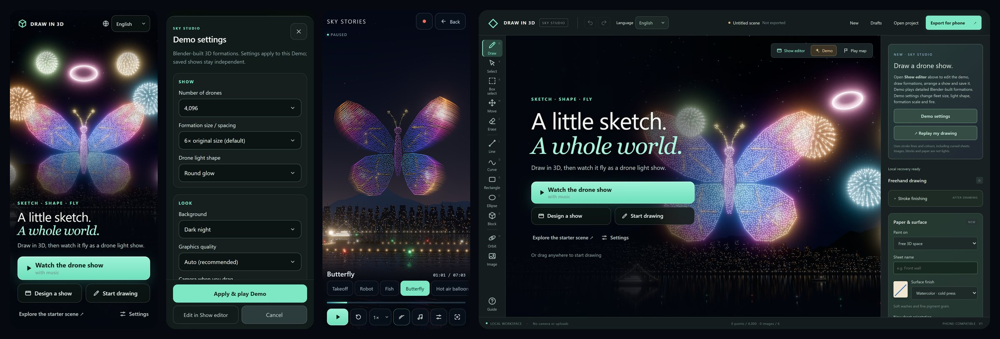

# Studio 24: a title screen, a settings sheet and touch-sized controls

## What's new

**A title screen.** The app now opens on a title screen instead of an empty canvas.
- **Key art:** a Blender render of the Demo's butterfly (the real formation lights) with ship fireworks, over the harbour at night.
- **Three actions:**
  - **Watch the drone show**, the main one;
  - **Design a show**;
  - **Start drawing**.
- **Also on the title:** *Explore the starter scene* and *Settings*.
- **On phones** it fills the screen, with a tall crop of the art in portrait and a wide one in landscape. On a landscape phone the main action used to fall off the bottom of the screen; now every action fits.
- **On a PC** it fills the drawing area. Dragging on the canvas starts drawing straight away, and the Show editor, Demo and Play map buttons stay above it.
- **Getting back:** after watching the show, **Back** returns to the title. The brand at the top left is now a **Home** button that brings the title back over your drawing. **Continue drawing** or Escape closes it again.

**Settings as a sheet.** Demo settings and Player settings are now grouped into **Show**, **Look** and **Effects**.
- **Controls:** tall select boxes, real on/off switches and the falling-fire formations as chips.
- **Buttons:** a close button, and Apply, Edit in Show editor and Cancel stay at the bottom.
- **On phones** it opens as a bottom sheet.
- **Corrected text:** ship fireworks are described as firing *all through the show*, as they have since Studio 23.

**One set of icons and touch-sized controls.**
- **Icons:** the text symbols (Ⅱ ↻ ♪ ⚙ ◎ ✎ …) are replaced by one set of 40 SVG icons, which look the same on every phone and PC.
- **Phones:**
  - controls are at least 40 px, and 44 px or more almost everywhere;
  - body text is at least 12 px;
  - the tool rail shows icons, and New / Drafts / Open / Export fold into a **Files** menu in the header;
  - the footer is hidden so the canvas keeps its height;
  - the "Tap Start" game banner no longer covers the Show editor and Demo buttons.
- **The player:** all the controls fit one row on a 360 px phone; Record becomes an icon; Trails is a toggle chip.

**A formation library.** In the Show editor, **＋ Demo formation…** now opens a picture catalogue of the twelve Demo formations, each drawn from its drone lights. One tap adds a formation.

**Vietnamese.**
- **Italic headline:** Georgia has no Vietnamese letters, so the italic headline broke "thế" apart; the headline now uses a font that has them.
- **The Demo's own names** (its title, formations and phases) now follow the app language. Names you type in your own shows stay as typed.
- **Messages:** 42 messages that still appeared in English now have Vietnamese, for example "Project opened…", the image and limit errors, and the Show editor's preview and draft notes. Messages with a detail after them ("Could not load Demo: …", "Video downloaded · …", "Drafts · 3") are translated too.
- **Phones:** long labels wrap to two balanced lines instead of three.

## Review fixes

A code and logic review of this batch and of the two commits before it (the Vietnamese interface, and the Show editor state fixes) found the following, all now fixed:
- **Keyboard shortcuts behind Home:** editor shortcuts no longer act behind the title after Home. Before, Delete could remove a selection you couldn't see.
- **The title coming back:** once you have drawn, Undo back to an empty canvas keeps you in the editor instead of bringing the title back.
- **Double launch:** a double tap on *Watch the drone show* loaded the Demo twice and cleared the loading state early. There is now one launch at a time.
- **Other title-screen fixes:**
  - opening, creating or restoring a project from the header closes it, instead of leaving it over the new project;
  - orbiting the camera during the show no longer dismisses it, so Back returns to it;
  - Escape in the Files menu closes only the menu and keeps your selection;
  - error messages appear above it on phones.
- **Accessibility:**
  - Focus moves to the canvas when the title closes.
  - The full-screen phone title makes the editor behind it inert.
  - The Home button's accessible name includes its visible "Draw in 3D".
  - *Edit in Show editor*, opened from the title's Settings, now returns to the drawing workspace.
- **Vietnamese:**
  - Every one of the Demo's 50 phase names and 22 formation names now reads in Vietnamese: "Forming …", the heart, star and firework-ball finale, "Returning home" and "Landed". The heading under the sentence works as a subtitle for the English words in the sky.
  - The player's button names are translated.
  - Switching language while the show is paused updates the heading at once.
  - A stray "Mở" no longer follows "Mở dự án" in the phone Files menu.
- **Phones:**
  - the Files button hides while a formation is being edited;
  - the tagline shows on phones tall enough for it.
- **Settings:** the ship fireworks description no longer claims they fire only during Happy day and the finale.
- **Tests:**
  - Six smoke scripts ignored `DRAW3D_URL` and always opened port 5173, which can belong to another app. They now honour it.
  - Five smokes asserted the stale "STUDIO 16" header badge; it reads "SKY STUDIO" now.
  - Two new unit tests fail if any message the app shows, or any Demo phase or formation name, has no Vietnamese.

## How it works

- **Styles:** `web/src/ui.css` is loaded last and refines the earlier stylesheets. It holds:
  - the tokens and the icon masks;
  - the title screen, the phone header and rail, the player HUD, the settings sheet and the Show editor chrome;
  - the formation library.
- **Icons:** a `data-icon` attribute draws an SVG mask on `::before`, so scripts that rewrite a button's text (the recorder, the player, Play map) keep working. State-driven icons follow `data-word` (pause, play, replay), `data-state` (music) and a class (recording, playing).
- **Title screen state** (`editor.js`): `titleVisible()` is true while nothing is drawn and the title hasn't been dismissed, or after Home. It is false while a formation is being edited. Any action, a canvas drag, a tool, a file action or Escape dismisses it.
- **Key art:** `tools/blender/render_keyart.py` renders `web/src/assets/keyart-wide.webp` and `keyart-tall.webp` with Cycles. It uses the same formation data and harbour stage as the README hero, with a very dark blue sky, stars, black-blue water and fireworks placed to leave room for the text. The build versions both images like the other assets.
- **Phone flows in tests:** smokes that act at phone size go through the title screen and the Files menu, as a person would. They use a small `files(page)` helper.

## Verification

- `cd web && npm test`: **119/119**, including the two new Vietnamese coverage tests.
- **All 20 smoke scripts pass.** The new `ui-smoke.mjs` checks:
  - the title screen on phones (portrait and landscape) and on a PC;
  - Home and Escape, including that Delete does nothing behind Home and that Undo to an empty canvas doesn't bring the title back;
  - the Files menu and the settings sheet;
  - the player at 360 px and in landscape;
  - the formation library;
  - the Vietnamese title and Demo names.
- **UI audit** at 390×844, 360×740, 844×390, 820×1180 and 1440×900, in English and Vietnamese, with no page errors. Before → after:

  | Screen | Controls under 40 px | Text under 11 px |
  |---|---|---|
  | Phone title / entry | 50 → 5 | 92 → 33 |
  | Phone editor | 52 → 5 | 91 → 38 |
  | Phone settings | 8 → 0 | 2 → 1 |
  | Phone Show editor | 45 → 8 | 29 → 1 |
  | Phone, 360 px, landscape and tablet player | 27–31 → 0 | 27–32 → 3–8 |
  | Landscape title / entry | 48 → 7 | 76 → 36 |

  - The remaining small targets are colour swatches, drawn as 36 px circles.
  - Most of the remaining small text is the icon-only tool labels, which are hidden on purpose but kept as accessible names.
  - The rest is the uppercase status and eyebrow labels (10 px capitals). The drawing inspector's badges and values were raised to 10.5–12 px on touch screens after the audit.
- **Real GPU** (RTX 4080 SUPER, Cinematic tier): the title screen, the settings sheet, the Demo and the player HUD on a phone, and the PC title, with no page errors.
