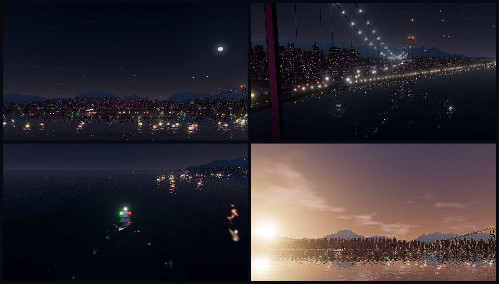

# Studio 25: a living harbour

## What's new

Around the drones, the harbour now has small living things. Each is drawn the light way: one draw call per kind, with every movement worked out on the graphics card.

**On the water:**
- **Floating lanterns** (*đèn hoa đăng*): a ring of warm paper lanterns drifts slowly round the launch area, just beyond the buoys. They bob and flicker, and their light runs long on the water.
- **Spectator boats**: boats cruise slow loops in front of the deck and between the anchored ships and the shore. Each has red and green side lights, a white masthead light, a warm cabin light, and a glowing wake (blue-green at night). The far boats pass under the bridge.
- **Glints**:
  - the water sparkles in the colours of the formation in the sky;
  - a path of moonlight glitter at night, or of sunlight in the late afternoon.

**On the shore and the bridge:**
- **Traffic**: head and tail lights stream both ways over the bridge deck and along the shore road.
- **Photo flashes**: cameras flash in the crowd along the far promenade, more often whenever fireworks are bursting.

**In the sky:**
- **Sky lanterns** rise from the far shore, sway in the breeze, and fade out high above the city.
- **Shooting stars** cross the night sky every 20 seconds or so.
- **A distant plane** crosses slowly, with blinking red, green and white lights.
- **Gulls** glide beside the show in the late afternoon, soft silhouettes against the low sun.
- **Clouds**: the late-afternoon clouds now drift.

## How it works

- **Where it lives:** `web/src/harbour-life.js` holds it all. `sky-stage.js` creates it with the stage and feeds it:
  - the time;
  - the formation's colour (for the glints);
  - the sky mode and fog;
  - how busy the fireworks are (`excitement()`, from the ship firework schedule).
- **The plan:** `lifePlan()` is a pure, seeded plan of everything: lane, ring, route and phase per item. The scene is the same on every visit, and tests can check where things go.
- **Placement** comes from the stage itself, measured from `assets/sky-stage.blend`: the bridge deck's polyline, the shore road, the promenade, the deck and buoys, and the anchored ships.
  - Lantern rings clear the buoys and the barges.
  - Boat loops stay clear of the deck, the buoys, the ships, the shore and the audience.
  - Gulls fly where the automatic director camera actually looks. It sits about 220–450 m in front of the show, 20–70 m up.
- **Drawing:** each family is a single draw.
  - The point families (traffic, lanterns, sky lanterns, boat lights and wakes, glints, sky events, flashes) share one soft-dot fragment. Each vertex shader computes its position from time.
  - The boat hulls (~30 triangles each) and gulls (8 triangles each) are instanced Lambert meshes, posed in the vertex shader. Gull wings flap and fold into glides.
  - Point sizes follow the target being drawn, so the water reflection gets correctly sized lights.
- **Per frame**, the CPU only sets a handful of uniforms. Nothing is allocated.
- **Budget per device:** the quality tier sets a `life` budget (Cinematic 1, Balanced 0.75, Battery 0.5) that scales every count.
- **Reduced motion:** everything holds still at one moment, and the flashes and shooting stars stay off.
- **For comparisons:** `?life=0` leaves harbour life out.

## Verification

- `cd web && npm test`: **125/125**. The new `harbour-life.test.mjs` checks:
  - the plan is seeded and scales with the budget;
  - lantern rings and complete boat loops stay clear of the deck, buoys, ships, shore and audience;
  - traffic keeps to the deck and the road;
  - the flashes follow the fireworks;
  - it uses one draw per family;
  - reduced motion freezes everything.
- **All 20 smoke scripts pass.**
- **Draw calls per frame** (real GPU):

  | Screen | Without | With |
  |---|---|---|
  | PC | 138 | 154 |
  | Phone (Cinematic) | 64 | 82 |
  | Phone tier (Battery, SwiftShader) | 31 | 39 |

  With water reflection on, each family is drawn into the reflection too. Hulls and gulls together are under 700 triangles.
- **Frame rate** on a weak-GPU proxy (SwiftShader, 390×844 at 2×), interleaved on/off runs:
  - Battery tier: 10.9 fps without and 12.7 fps with (medians of three runs each).
  - Balanced tier: 9.6 vs 9.3 fps, and 7.1 vs 6.8 fps in a second pass.
  - So the cost is within the run-to-run noise. This machine was shared with many other jobs, so single runs varied by up to ±15%.
- **Real GPU** (RTX 4080 SUPER): night and late afternoon, on a phone and a PC, with no page errors.
