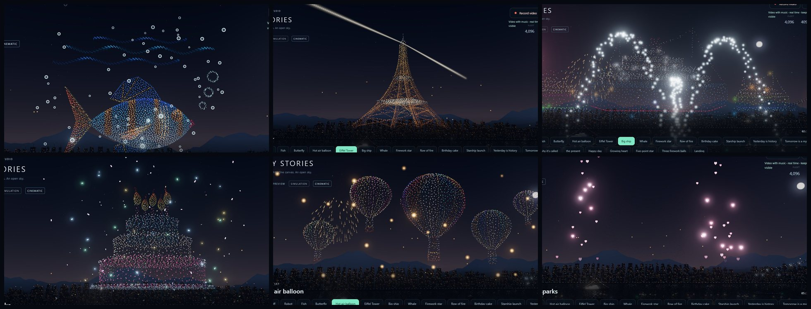

# Studio 26: every scene has its own little touch

## What's new

Each scene of the show now has one small detail that belongs to it. It fades in while the drones fly into the formation and leaves straight after.

| Scene | Its accent |
|---|---|
| Robot | radio rings spreading from its antenna, blue sparks orbiting it |
| Fish | bubbles rising and wobbling round it |
| Butterfly | fireflies blinking around its wings and down to the water |
| Hot air balloon | lanterns rising from the water with the balloons |
| Eiffel Tower | two searchlights sweeping from the top, like the real tower |
| Big ship | fireboats saluting: two crossing water arches and a fountain |
| Whale | ripples spreading on the water under it |
| Firework star | glitter stars drifting down |
| Row of fire | embers rising and curling over the flames |
| Birthday cake, Happy day | confetti fluttering down |
| Starship launch | sparks bursting from its base as it rises |
| Growing heart | little hearts floating up on either side, never over the family inside |
| Five-point star | a shower of shooting stars radiating from behind it |

The sentence before Happy day, the finale's firework balls, the takeoff and the landing keep the sky to themselves.

Your own formations get accents too, from their motion or effect:

| Motion or effect | Accent |
|---|---|
| Swim (fish) | bubbles |
| Swim (whale) | ripples |
| Wings flap | fireflies |
| Balloons drift up | lanterns |
| Candle flames | confetti |
| Falling fire | embers |
| Firework sparkle | glitter |
| Starship rise | launch sparks |

## How it works

- **Windows** (`accentWindows()` in `web/src/scene-accents.js`): the show's stages give each accent a window, from 55% into the flight to 1.2 s after the scene. The heart's grow, beat and falling sparks merge into one window, as do the star's.
- **Placement:** an accent is placed by its formation's box. A rising formation (the balloons, the Starship) carries its accent up with it.
- **Drawing:** every accent is one point cloud. All of them share a single shader program, which places each particle from time and the box. The shapes are dots, rings (bubbles, radio waves), rings lying flat on the water (ripples), four-point stars, hearts and spinning confetti.
- **Per frame**, the CPU picks the active window and sets a few uniforms. A hidden kind costs no draw call, and at most two draw at once (during a hand-over).
- **Budget per device and reduced motion:** counts follow the same per-tier `life` budget as the harbour life (Studio 25). Reduced motion turns accents off, and `?life=0` leaves them out too.

## Verification

- `cd web && npm test`: **129/129**. The new `scene-accents.test.mjs` checks:
  - every Demo scene gets its accent, and the sentence, finale, takeoff and landing get none;
  - the windows cover each scene and never more than two accents draw at once;
  - accents sit on their formation, and the launch sparks follow the rising Starship;
  - your own formations get accents from their motion or effect;
  - reduced motion turns accents off.
- **All 20 smoke scripts pass.**
- **Real GPU** (RTX 4080 SUPER): every scene was captured with its accent, with no page errors.
- **Weak-GPU proxy** (SwiftShader, phone tier, 390×844 at 2×), harbour life and accents on vs off in interleaved runs:
  - the frame rate is unchanged: medians 14.8 vs 14.9 fps;
  - draw calls go from 31 to 40 (the 8 harbour families plus one accent).
